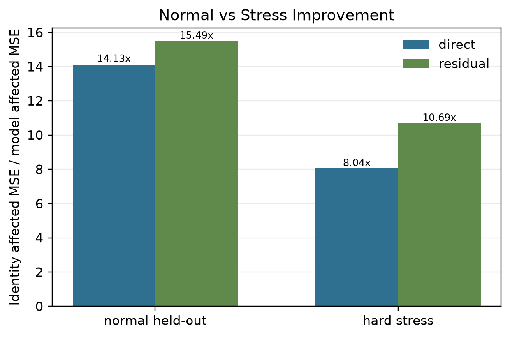
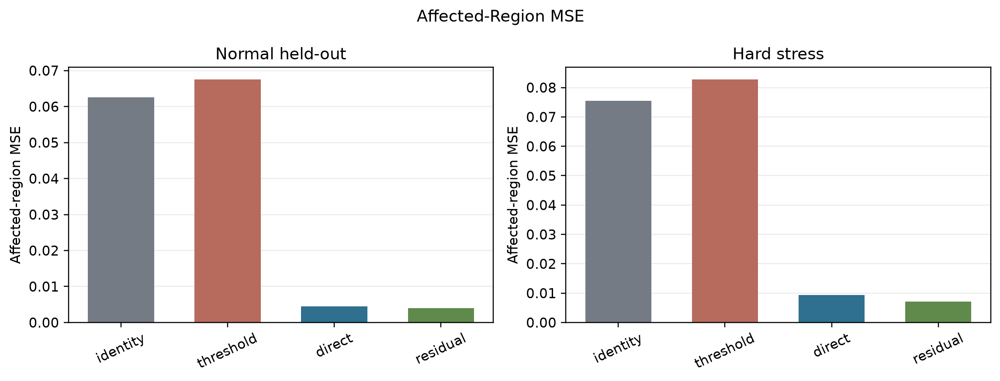
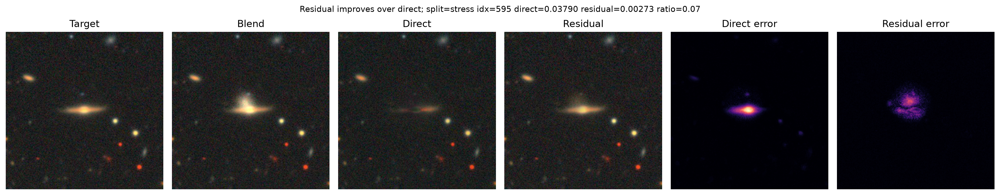

# Thayer-Net

Thayer-Net is a compact [U-Net][U-Net]-based testbed for controlled synthetic
galaxy deblending with [Galaxy10 DECaLS] cutouts. It studies whether a learned
image-to-image model can recover a target galaxy from blends built with known
targets and controlled contaminant foregrounds.

This is a controlled synthetic deblending project, not a full survey-grade
pipeline.

## TL;DR

Thayer-Net trains compact U-Nets to remove a synthetic contaminating galaxy from
a blended RGB image. The current checkpoint compares two formulations:

- Direct reconstruction: `blended -> target`
- Residual prediction: `blended -> residual`, then `target = blended - residual`

Affected-region metrics are emphasized because most pixels in each synthetic
image are unchanged. Whole-image scores are still reported, but affected-region
MSE better isolates the pixels where the contaminant actually altered the target
image.

## Current Results

The main experiments use 5,000 training blends, 800 validation blends, 800
normal held-out blends, and 20 training epochs. The hard stress test uses 1,000
synthetic blends with small shifts, bright contaminants, similar-or-larger
contaminant sizes where possible, no rotation, and an affected-region threshold
of 0.02.

| Model | Normal affected MSE | Normal improvement | Stress affected MSE | Stress improvement |
| --- | ---: | ---: | ---: | ---: |
| Identity | 0.062555 | 1.00x | 0.075541 | 1.00x |
| Direct U-Net | 0.004428 | 14.13x | 0.009390 | 8.04x |
| Residual U-Net | 0.004039 | 15.49x | 0.007069 | 10.69x |



Residual prediction improves affected-region MSE over direct reconstruction on
both normal held-out and hard stress tests.



Affected-region MSE highlights reconstruction quality only where the contaminant
altered the target image.

## Direct vs Residual

The direct U-Net already beats identity and threshold baselines by a large
margin on controlled blends. Its affected-region MSE improves over identity by
about 14.13x on the normal held-out set and about 8.04x on the hard stress set.

Residual prediction improves the aggregate affected-region MSE further:

- Normal held-out: 0.004428 direct vs 0.004039 residual.
- Hard stress: 0.009390 direct vs 0.007069 residual.
- Stress worse-than-identity cases: 13/1000 for direct vs 0/1000 for residual.
- Per-sample wins: residual beats direct on 310/800 normal cases and 667/1000
  stress cases.

Residual is not universally better. On the normal aggregate, direct has slightly
better affected-region MAE, and direct reconstruction still wins on some
individual examples. The current result is more specific: residual prediction is
better in aggregate and especially improves stress-test robustness.



Residual prediction can preserve target structure better in stress cases, but
direct reconstruction remains better on some individual examples.

## Limitations and Failure Modes

The models perform well on many visually separable blends, but ambiguous overlap
still matters. Remaining failures involve target-core obstruction, contaminant
and target structures that are hard to distinguish, over-smoothing, and loss of
target detail. Some large obvious contaminants are severe but easy to subtract;
some lower-severity blends are hard because they hit the target core.

Earlier figures may display the generator's legacy easy/medium/hard metadata.
These labels are retained for provenance but are not treated as model-failure
categories. Current analysis separates generation difficulty, measured blend
severity, core obstruction, and model failure.

## Research Question

Can a compact convolutional model recover the target galaxy from controlled
synthetic blends more accurately than simple image-processing baselines, and how
does performance change with overlap, contaminant brightness, blur, noise, and
apparent source size?

## Why Deblending Matters

Astronomical surveys often observe overlapping sources in crowded or deep
fields. If blended light is assigned to the wrong object, downstream
measurements of flux, morphology, color, and redshift can be biased. This
project uses a controlled benchmark to study which synthetic blend conditions
are learnable and where simple models fail.

## Dataset

This repository does not include the dataset. Download
[Galaxy10 DECaLS][Galaxy10 DECaLS download] separately and place the HDF5 file
at:

```text
data/Galaxy10_DECals.h5
```

The [data](data/) directory is kept in the repository with
[data/.gitkeep](data/.gitkeep), while dataset files are ignored by git.

## Method Overview

- Original images are split into train, validation, and test subsets before
  synthetic blends are generated.
- Synthetic blends add only extracted contaminant foreground light to the
  target, avoiding full rectangular cutout artifacts.
- Halo-aware masks preserve diffuse contaminant outskirts while tapering before
  the cutout edges.
- Baselines include identity reconstruction and thresholded connected-component
  segmentation.
- Direct and residual U-Nets are evaluated with MSE, MAE, PSNR, and SSIM over
  the whole image and over affected regions.
- `generation_difficulty` is legacy generator metadata from sampled parameters.
- `blend_severity_score` and `blend_severity_bin` measure image damage after
  blend construction.
- `core_obstruction_fraction` and `core_overlap_bin` describe target-core
  overlap.
- `model_failure_score` and `model_improvement_ratio` measure model behavior.

For implementation details, see [docs/methodology.md](docs/methodology.md).
For a concise checkpoint summary, see
[docs/checkpoint_summary.md](docs/checkpoint_summary.md).

## Repository Structure

```text
thayernet/
├── configs/                  # Portable experiment defaults
├── data/                     # Local dataset location; dataset files ignored
├── docs/                     # Project plan, methodology, dataset notes, logs
├── notebooks/                # Main experiment notebook
├── reports/                  # Public-safe figures and future report assets
├── scripts/                  # Reproducible training/evaluation scripts
├── src/                      # Reusable data, blending, model, training code
├── LICENSE
├── README.md
├── pyproject.toml
└── requirements.txt
```

## Quickstart

Python 3.11 or 3.12 is recommended because scientific Python and [PyTorch]
wheels can lag newer Python releases.

```bash
python3 -m venv .venv
source .venv/bin/activate
pip install -r requirements.txt
```

Place the dataset at `data/Galaxy10_DECals.h5`, then start [JupyterLab]:

```bash
jupyter lab
```

Open [`notebooks/galaxy_deblending.ipynb`][experiment notebook] to inspect the
notebook workflow. Larger experiments are captured by scripts under `scripts/`.

## Reproducibility Notes

- Original images are split before blending to avoid source-image leakage.
- Synthetic blend generation accepts a [NumPy] random generator for fixed-seed
  experiments.
- Generated outputs, checkpoints, cached files, and the Galaxy10 DECaLS HDF5
  file are intentionally excluded from version control.
- Existing blend objects in a live notebook session do not update after editing
  [src/blend.py](src/blend.py); regenerate blends after restarting or reloading.

## Current Next Steps

- Build a core-obstruction-balanced evaluation split.
- Try residual training with affected-region weighting.
- Improve foreground extraction diagnostics and preprocessing checks.
- Add more realistic sky, PSF, noise, and background simulation.
- Write the final report with the direct, stress, and residual results.

## License

This project is licensed under the [Apache License 2.0]. See [LICENSE](LICENSE)
for details.

[Apache License 2.0]: https://www.apache.org/licenses/LICENSE-2.0
[Galaxy10 DECaLS]: https://astronn.readthedocs.io/en/latest/galaxy10.html
[Galaxy10 DECaLS download]: https://zenodo.org/records/10845026
[JupyterLab]: https://jupyterlab.readthedocs.io/
[NumPy]: https://numpy.org/
[PyTorch]: https://pytorch.org/
[U-Net]: https://arxiv.org/abs/1505.04597
[experiment notebook]: notebooks/galaxy_deblending.ipynb
