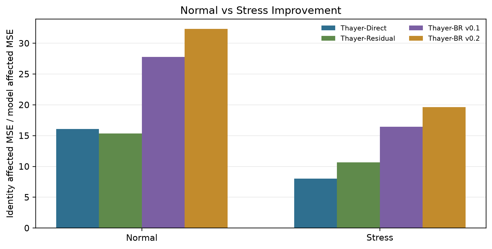

# Thayer-Net

Thayer-Net is a compact U-Net research testbed for controlled synthetic galaxy
deblending with Galaxy10 DECaLS cutouts. It asks whether learned image-to-image
models can reconstruct a known target galaxy from synthetic blends more
accurately than simple non-learning baselines, and how that behavior changes
under harder overlap conditions.

This repository is a controlled synthetic benchmark. It is not a full
survey-grade astronomical deblending pipeline.

## TL;DR

Current best model: **Thayer-BR v0.2 Moderate** on this controlled synthetic
benchmark.

| Evaluation | Identity affected MSE | Thayer-BR v0.2 Moderate affected MSE | Improvement |
| --- | ---: | ---: | ---: |
| Normal held-out | 0.068122 | 0.002108 | ~32.3x |
| Hard stress test | 0.075541 | 0.003847 | ~19.6x |

Multi-seed audit:

- Normal: `32.02 +/- 1.21x`.
- Stress: `19.55 +/- 0.30x`.

Affected-region metrics are emphasized because most pixels are unchanged in
each synthetic blend. Whole-image scores are still useful, but affected-region
MSE better isolates pixels where the contaminant actually altered the target.

Because these improvements are large, the evaluation was audited across mask
thresholds, mask dilation, multi-seed tests, residual logic checks, checkpoint
integrity checks, and visual diagnostics. See
[docs/evaluation_audit_summary.md](docs/evaluation_audit_summary.md).



## Model Naming

**Thayer-Net** refers to the overall project and model family.

The evaluated model variants are:

- **Thayer-Direct:** direct reconstruction U-Net, trained to map
  `blended -> target`.
- **Thayer-Residual:** residual prediction U-Net, trained to map
  `blended -> residual`, with reconstruction computed as
  `blended - predicted_residual`.
- **Thayer-BR v0.1:** previous balanced
  hard-case residual U-Net trained on 8,000 synthetic blends with a 50/30/20 mix
  of normal, high-overlap/core-obstruction, and brightness/size-stress cases.
- **Thayer-BR v0.2 Moderate:** current best model, a balanced residual U-Net
  with moderate affected/core-weighted residual loss.
- **Thayer-BR v0.2 Strong:** stronger weighted-loss ablation, not the current
  best model.

The current headline results refer to **Thayer-BR v0.2 Moderate** on a
controlled synthetic benchmark, not to a stable public deployment model.

## Current Best Result

These are controlled synthetic evaluations with known clean targets, not
real-survey deployment metrics.

| Evaluation set | Identity affected MSE | Thayer-BR v0.2 Moderate affected MSE | Improvement |
| --- | ---: | ---: | ---: |
| Normal held-out blends | 0.068122 | 0.002108 | ~32.3x |
| Hard stress-test blends | 0.075541 | 0.003847 | ~19.6x |

The full comparison table with identity, threshold, Thayer-Direct,
Thayer-Residual, Thayer-BR v0.1, and Thayer-BR v0.2 Moderate is in
[docs/checkpoint_summary.md](docs/checkpoint_summary.md).

## Why This Result Is Not Just a Lucky Run

The audit reran evaluation only; it did not train, retrain, or modify
checkpoints.

- Multi-seed normal evaluation: `32.02 +/- 1.21x` improvement over identity.
- Multi-seed stress evaluation: `19.55 +/- 0.30x` improvement over identity.
- Thayer-BR v0.2 Moderate is the best aggregate model in the current controlled
  synthetic evaluation.
- The model ranking stayed stable across affected-mask thresholds `0.005`,
  `0.01`, `0.02`, and `0.04`.
- The model ranking stayed stable when affected masks were dilated by `0`, `1`,
  `3`, `5`, and `9` pixels, which checks sensitivity to halo inclusion.
- Checkpoint integrity logs confirmed that the Thayer-Direct, Thayer-Residual,
  Thayer-BR v0.1, and Thayer-BR v0.2 Moderate checkpoints were unchanged before
  and after evaluation/audit runs.

<details>
<summary>Evaluation audit details</summary>

Audit run: `outputs/runs/evaluation_audit_20260708_220833/`.

The affected-region mask was verified to use
`abs(blended - target).mean(axis=-1) > threshold`, so it is based on where the
synthetic blend changed the clean target, not on model prediction error.

The audit tested whether the headline result depended on one mask definition.
The balanced/weighted model ranking stayed stable across tested thresholds and
dilation radii. The dilation check is especially important because it asks
whether faint halo contamination just outside the original mask would change the
conclusion.

The residual reconstruction path was checked visually and numerically:
`residual = blended - target`, prediction is the residual layer, and
`target_hat = blended - predicted_residual`. Clipping is applied after
subtraction for metrics and visualization.

Visual diagnostics were generated for blend construction, affected masks,
target-core obstruction, residual predictions, model outputs, and failure or
counterexample cases. These diagnostics are intended to make suspicious results
visible rather than hiding them in aggregate tables.

</details>

## What Was Audited

- Affected-mask thresholds: `0.005`, `0.01`, `0.02`, `0.04`.
- Mask dilation radii: `0`, `1`, `3`, `5`, `9`.
- Multi-seed normal and hard stress evaluations.
- Residual reconstruction logic and sign convention.
- Visual blend, mask, residual, and model-output diagnostics.
- Apparent-size, centrality, halo-band, and visual-vs-metric diagnostics.
- Checkpoint paths, file sizes, and modified times before and after evaluation.
- Split-before-blending logic and same-runtime sample comparability.

## Limitations

The current results are for controlled synthetic blends with known targets. They
should not be interpreted as validated real-survey performance.

Remaining limitations include ambiguous source overlap, target-core
obstruction, target-detail loss, over-smoothing, simplified sky/noise modeling,
missing PSF variation, and synthetic foreground-extraction assumptions.

Thayer-BR v0.2 Moderate is not universally best on every individual example.
Thayer-Direct and Thayer-Residual still win on some samples, especially where
their inductive biases preserve a particular target structure better.
Thayer-BR v0.1 also wins on some v0.2 counterexamples.

The size/visual audit found broad apparent size variation and selected
halo-like artifacts in individual v0.2 outputs. Aggregate halo-band error still
improved relative to Thayer-BR v0.1, but future work should include a
size-normalized benchmark.

The audit confirms the current controlled benchmark result; it does not prove
performance on real crowded survey scenes. Future evaluations should save exact
generated evaluation sets and global source indices so historical generated
samples can be reloaded directly.

## Links to Deeper Docs

- [Methodology](docs/methodology.md): blend generation, masking, metrics, and
  residual reconstruction.
- [Current best model](docs/current_best_model.md): short v0.2 Moderate summary.
- [Release summary](docs/releases/thayer_br_v0_2.md): research checkpoint
  announcement for Thayer-BR v0.2 Moderate.
- [Model card](docs/model_card_thayer_br_v0_2.md): technical model details,
  intended use, limitations, and metrics.
- [Evaluation audit summary](docs/evaluation_audit_summary.md): concise audit
  trail for the headline result.
- [Checkpoint summary](docs/checkpoint_summary.md): experiment history,
  checkpoint-level results, and audit summary.
- [Results interpretation](docs/results_interpretation.md): how to read the
  affected-region metrics, threshold baseline, core obstruction, and caveats.
- [Paper plan](docs/paper_plan.md): recommended paper framing and claims to
  avoid.

## Research Question

Can a compact convolutional model recover the target galaxy from controlled
synthetic blends more accurately than simple image-processing baselines, and how
does performance change with overlap, contaminant brightness, blur, noise, and
apparent source size?

## Dataset

This repository does not include the dataset. Download Galaxy10 DECaLS
separately and place the HDF5 file at:

```text
data/Galaxy10_DECals.h5
```

The `data/` directory is kept in the repository with `data/.gitkeep`, while
dataset files are ignored by git.

## Method Overview

- Original images are split into train, validation, and test subsets before
  synthetic blends are generated.
- Synthetic blends add only extracted contaminant foreground light to the
  target, avoiding rectangular cutout/background artifacts.
- Halo-aware masks preserve diffuse contaminant outskirts while tapering before
  cutout edges.
- Baselines include identity reconstruction and a simple threshold/connected
  component method.
- Thayer-Direct, Thayer-Residual, Thayer-BR v0.1, and Thayer-BR v0.2 Moderate
  are evaluated with whole-image and affected-region metrics.
- Hard stress testing uses smaller shifts, bright contaminants, similar-size
  sources where possible, blur/noise perturbations, and a minimum affected mask
  fraction.
- Thayer-BR v0.2 Moderate adds affected/core-weighted residual loss while
  keeping the residual prediction formulation.

For implementation details, see [docs/methodology.md](docs/methodology.md).
For a concise project summary, see
[docs/checkpoint_summary.md](docs/checkpoint_summary.md).

## Repository Structure

```text
thayernet/
├── configs/                  # Portable experiment defaults
├── data/                     # Local dataset location; dataset files ignored
├── docs/                     # Methodology, experiment logs, paper planning
├── notebooks/                # Main experiment notebook
├── reports/                  # Public-safe figures and paper skeleton
├── scripts/                  # Reproducible training/evaluation scripts
├── src/                      # Reusable data, blending, model, training code
├── LICENSE
├── README.md
├── pyproject.toml
└── requirements.txt
```

## Quickstart

Python 3.11 or 3.12 is recommended because scientific Python and PyTorch wheels
can lag newer Python releases.

```bash
python3 -m venv .venv
source .venv/bin/activate
pip install -r requirements.txt
```

Place the dataset at `data/Galaxy10_DECals.h5`, then start JupyterLab:

```bash
jupyter lab
```

Open `notebooks/galaxy_deblending.ipynb` to inspect the notebook workflow.
Larger formal experiments are captured by scripts under `scripts/`.

## Reproducibility Notes

- Original images are split before blending to avoid source-image leakage.
- Synthetic blend generation accepts a NumPy random generator for fixed-seed
  experiments.
- Generated outputs, saved model checkpoints, cached files, and the Galaxy10
  DECaLS HDF5 file are intentionally excluded from version control.
- Existing blend objects in a live notebook session do not update after editing
  `src/blend.py`; regenerate blends after restarting or reloading.

## Current Next Steps

- Preserve exact generated evaluation sets and global source indices for future
  reproducibility.
- Finalize paper figures from `reports/figures/` and the latest reviewed output
  figures.
- Write the LaTeX report.
- Improve preprocessing diagnostics and foreground extraction checks.
- Run a size-normalized held-out benchmark before making stronger claims about
  size-invariant deblending.
- Add more realistic sky, PSF, noise, and background simulation.

## License

This project is licensed under the Apache License 2.0. See `LICENSE` for
details.
