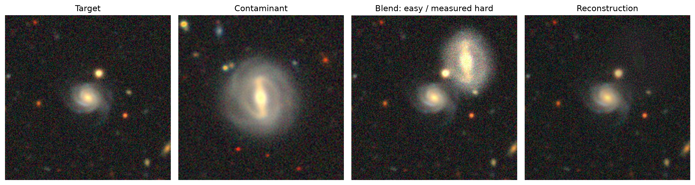
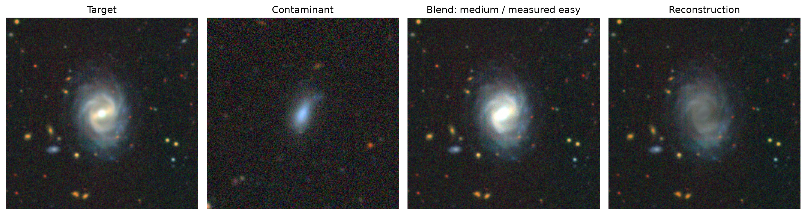

# Thayer-Net

> Thayer-Net is named after Thayer Street in Providence, the street outside my
> dorm room where this project began. The name also reflects the model’s
> [U-Net][U-Net]-based architecture.

## Learning to Unblend the Sky

Thayer-Net is a lightweight [U-Net][U-Net]-based model for reconstructing target
galaxy images from controlled synthetic blends. This project studies whether a
compact learned model can recover a target galaxy from blends built using
[Galaxy10 DECaLS] images.

## TL;DR

Thayer-Net trains a compact [U-Net] to remove a synthetic contaminating galaxy
from a blended astronomical image and recover the original target galaxy.

In the current direct-reconstruction experiment, the model reduces whole-image
MSE by about **9x** and affected-region MSE by about **14x** compared with the
identity baseline on held-out synthetic blends.

This project is a controlled synthetic deblending testbed, not a full
survey-grade deblending system.

## Current Results

The current direct-reconstruction [U-Net] was trained on:

- 5,000 training blends
- 800 validation blends
- 800 held-out test blends
- 20 epochs

Headline results on the held-out test set:

| Metric              | Identity Baseline |    Model | Improvement |
| ------------------- | ----------------: | -------: | ----------: |
| Whole-image MSE     |          0.005224 | 0.000566 |       ~9.2x |
| Affected-region MSE |          0.062555 | 0.004428 |      ~14.1x |

Affected-region metrics are especially important because most pixels in each
image are unchanged. They measure reconstruction quality only where the
synthetic contaminant actually altered the target image.



Example successful reconstruction. The direct U-Net removes a visually
significant contaminant while preserving the target galaxy structure.

## Limitations and Failure Modes

The current model performs well on many visually separable blends, but it still
struggles when the contaminant is large, bright, highly overlapping, or aligned
with the target core. In these cases, the model may suppress the contaminant
while also losing some target-galaxy structure.

The original easy/medium/hard metadata was also found to be too coarse: some
generated “easy” blends are visually difficult. The project therefore adds a
measured blend-severity analysis based on how strongly the contaminant changes
the target image.



Partial failure case. The model suppresses some contaminating structure but
loses target detail in an ambiguous overlapping region.

> These failure modes are the focus of the next checkpoint: a balanced hard-case
> stress test, larger training runs, and a residual-prediction variant that learns
> the contaminating layer to subtract instead of redrawing the full target galaxy.

## Research Question

Can a compact convolutional model recover the target galaxy from synthetic
blends more accurately than simple image-processing baselines, and how does
performance change with overlap, contaminant brightness, blur, noise, and
apparent source size?

## Why Deblending Matters

Astronomical surveys often observe overlapping sources in crowded or deep
fields. If blended light is assigned to the wrong object, downstream
measurements of flux, morphology, color, and redshift can be biased.
This project does not attempt full survey-grade deblending. Instead, it builds
a controlled testbed for studying which blend conditions are learnable and
where simple models fail.

## Dataset

This repository does not include the dataset. Download
[Galaxy10 DECaLS][Galaxy10 DECaLS download] separately and place the HDF5 file
at:

```text
data/Galaxy10_DECals.h5
```

The [data](data/) directory is kept in the repository with
[data/.gitkeep](data/.gitkeep), while dataset files are ignored by git. The
notebook expects the portable path above by default.

## Method Overview

- Synthetic blend generation: pairs of original images are sampled from the
  same split and combined with controlled shift, brightness, blur, noise, and
  optional rotation.
- Foreground extraction and halo-aware masking: only the contaminant foreground
  is added to the target, preserving diffuse halo light while avoiding
  rectangular cutout artifacts.
- Baselines: identity reconstruction and thresholded connected-component
  segmentation provide lightweight non-learning references.
- [U-Net] model: a compact [PyTorch] [U-Net] maps blended RGB images to
  reconstructed target RGB images.
- Metrics: MSE, MAE, PSNR, and SSIM are computed both over the whole image and
  over affected regions.
- Severity analysis: original easy/medium/hard labels are supplemented with
  measured blend-severity scores based on how strongly the contaminant changes
  the image.

For both a brief technical summary and a longer implementation-level explanation
of the blending procedure, see [docs/methodology.md](docs/methodology.md).

## Repository Structure

```text
thayernet/
├── configs/                  # Portable experiment defaults
├── data/                     # Local dataset location; dataset files ignored
├── docs/                     # Project plan, methodology, dataset notes, logs
├── notebooks/                # Main experiment notebook
├── reports/                  # Future paper/report and final public figures
├── src/                      # Reusable data, blending, model, training code
├── LICENSE
├── README.md
├── pyproject.toml
└── requirements.txt
```

## Quickstart

Python 3.11 or 3.12 is recommended because scientific Python and [PyTorch]
wheels can lag newer Python releases.

```bash
python3 -m venv .venv
source .venv/bin/activate
pip install -r requirements.txt
```

Place the dataset at `data/Galaxy10_DECals.h5`, then start [JupyterLab]:

```bash
jupyter lab
```

Open [`notebooks/galaxy_deblending.ipynb`][experiment notebook] and run the
cells in order.

## Reproducibility Notes

- Original images are split into train, validation, and test subsets before
  synthetic blends are generated.
- Synthetic blend generation accepts a [NumPy] random generator so experiments
  can be repeated with fixed seeds.
- Existing blend objects in a live notebook session do not update after editing
  [`src/blend.py`](src/blend.py); regenerate blends after restarting or
  explicitly reloading the module.
- Generated outputs, checkpoints, cached files, and the Galaxy10 DECaLS HDF5
  file are intentionally excluded from version control.

## Paper and Report

This repository currently contains the experimental pipeline and working
notebook for the project. A formal research paper/report will be added after
the full set of experiments, figures, and evaluation tables are completed.

The future report and final public-safe figures will live under
[`reports/`](reports/). Draft PDFs, generated figures, checkpoints, and
experimental outputs should not be committed unless they are final and
explicitly reviewed.

## Current Status and Next Steps

The repository contains the data-loading, synthetic-blending, baseline, model,
training, and evaluation workflow for the first direct-reconstruction evaluation.

**Next steps include:**

- refining measured blend-severity labels,
- running a balanced hard-case stress test,
- saving final evaluation tables and selected figures,
- testing a residual-prediction variant that predicts the contaminant layer
  rather than reconstructing the full target image directly,
- writing the final research report.

## License

This project is licensed under the [Apache License 2.0]. See [LICENSE](LICENSE)
for details.

[Apache License 2.0]: https://www.apache.org/licenses/LICENSE-2.0
[Galaxy10 DECaLS]: https://astronn.readthedocs.io/en/latest/galaxy10.html
[Galaxy10 DECaLS download]: https://zenodo.org/records/10845026
[JupyterLab]: https://jupyterlab.readthedocs.io/
[NumPy]: https://numpy.org/
[PyTorch]: https://pytorch.org/
[U-Net]: https://arxiv.org/abs/1505.04597
[experiment notebook]: notebooks/galaxy_deblending.ipynb
