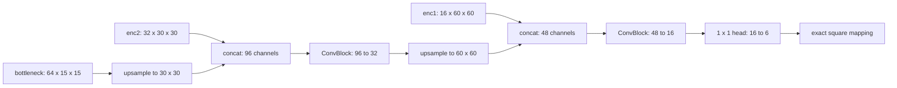

# D3 L0 Architecture Contract

The executable L0 contract is the exact
`src.output_parameterization.MappedCompactExpertDecoder("square")` class with
two independent experts. Each expert consumes `(bottleneck, enc2, enc1)` and
uses the frozen decoder topology:

Each `ConvBlock` contains two 3-by-3 convolutions with GroupNorm and SiLU.
The final decomposition head has weight shape `[6,16,1,1]` and bias shape
`[6]`. The complete model has 46,470 trainable parameters per expert and
92,940 total. The audit found no shared parameter object between experts.

Initialization seeds are `2026071201` and `2026071202`. The exact persisted
initial state has 18 float32 tensors per expert. Strict loading reported no
missing or unexpected keys, all shapes matched, seeded reconstruction matched,
and the square mapping matched its frozen implementation hash. The synthetic
forward exercised production feature shapes and six-channel outputs on MPS;
all raw, mapped, and physical outputs were finite and mapped physical outputs
were nonnegative.

This is an executable architecture result only. Scientific L0 reachability and
D3 success remain unknown.
