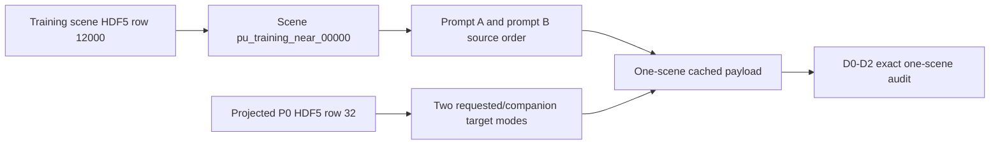
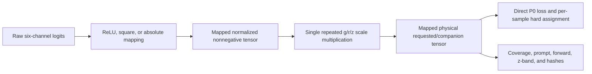

# Thayer-RI / Thayer-FFR Final Report

## Decision

Primary outcome: **FROZEN-FEATURE CONDITIONING BARRIER**.

Square was the only mapping to pass direct raw-logit optimization (D0), and it
also passed free-penultimate optimization with the restored rank-six final
heads frozen (D1). Its frozen-penultimate, final-head-only condition (D2)
failed own, alternate, and both-mode coverage. ReLU and absolute value failed
D0. The frozen progression rule therefore prohibited D3 and tangent-space
diagnostics.

This is a one-scene fixed-feature diagnosis. It does not select a deployable
mapping, establish decoder capacity, authorize a capacity ladder, or support a
broader-data claim.

## D0-D3 outcome

| Condition | ReLU | Square | Absolute |
| --- | --- | --- | --- |
| D0: free raw logits | Fail | Pass | Fail |
| D1: free penultimate tensors | Stopped | Pass | Stopped |
| D2: final head only | Stopped | Fail | Stopped |
| D3: full L0 decoder | Stopped | Stopped | Stopped |

Every executed condition ran exactly 5,000 MPS steps with no early-success
stop. All 12 mapping/condition initial physical tensors were byte-identical to
their persisted mapping-specific endpoint state.

Key final values:

| Condition | Mapping | Parameters | Initial loss | Final loss | Both-mode |
| --- | --- | ---: | ---: | ---: | ---: |
| D0 | ReLU | 86,400 | 3.4653e-5 | 4.2012e-5 | 0% |
| D0 | square | 86,400 | 6.2287e-6 | 3.6147e-10 | 100% |
| D0 | absolute | 86,400 | 1.6069e-5 | 2.5872e-6 | 0% |
| D1 | square | 230,400 | 6.2287e-6 | 3.1026e-9 | 100% |
| D2 | square | 204 | 6.2287e-6 | 4.4516e-6 | 0% |

Square D2 captured about 28.5% of the direct target-loss residual but entered
none of the frozen scientific coverage regions. Its two augmented fixed-feature
design matrices each had rank 17.

## Integrity and implementation evidence

- Primary preregistration SHA-256:
  `2170c367d0c97e92474ef317c86be2b136555d54599d723984e48229616f8c52`.
- Primary freeze: `2026-07-13T07:34:33.041737+00:00`.
- First exact per-scene load: `2026-07-13T07:47:49.358046+00:00`.
- Stage confirmation SHA-256:
  `dda4db05ed639fa1cf64721f719442ffbc2905600a684b5afc3470147fa59040`.
- Final superseding validation: 29 checks, zero failures.
- Access log at final validation: 153,464 decisions.
- Blocked-access log at final validation: 9,872 denied decisions; none was
  relabeled as allowed.
- Historical checkpoint audit: 600 exact paths, zero byte or hash mismatches
  before or after.
- Production-source corrections: none.
- Staged index: empty.
- README diff: empty.

The closed local execution graph contained:

1. `scripts/run_thayer_output_parameterization_micro.py`
2. `scripts/bootstrap_thayer_output_parameterization.py`
3. `scripts/run_thayer_two_expert_micro_overfit.py`
4. `scripts/evaluate_probabilistic_unet_pre_atlas.py`
5. `scripts/thayer_select_prompt_ablation_common.py`
6. `src/canonical_tensor_hash.py`
7. `src/competing_hypotheses.py`
8. `src/models_two_expert_decoder.py`
9. `src/models_probabilistic_unet.py`
10. `src/output_parameterization.py`

The static audit dispositioned all 391 requested high-risk occurrences: 151
were correct on the active path and 240 were not on the execution path. No
result-changing implementation defect was proved.

Independent references passed 13 comparison groups with zero mismatches. They
covered all three mappings, hard per-sample two-permutation assignment,
requested/companion splitting, prompt swap, canonical hashing, Gaussian prompt
construction, forward evaluation, scientific distance, batch order,
MPS-to-CPU canonicalization, and the full truth-coverage evaluator. The final
recheck again passed all 13 groups.

All seven corrected nonnegative golden cases passed. Differential full-pipeline
truth injection accepted exact P0 and expert-order permutation, and rejected
collapsed mean, requested/companion swap, wrong band order, wrong prompt/source
order, and sum-preserving incorrect allocation.

## Exact lineage

Scene ID, pair ID, source centroids, prompt order, target count, shapes, and all
four P0 canonical hashes matched the authoritative records. The truth prompt
swap was exact. P0 prompt targets are independently projected; they are not
required to be numerically identical after channel swap. The production and
reference semantic checks agreed.

Ordinary-row, eight-scene, remaining-microset, Atlas, development, and lockbox
load counts were all zero.

## Normalization and output contract

The frozen training-only normalization was inverted exactly once. Its maximum
float32 round-trip error was 0.0009765625 detected electrons. Loss and every
evaluation consumer used the identical mapped physical tensor; no evaluation
clip or second physical path was found.

## Gradient and optimizer trace

One fresh traced AdamW step per mapping showed:

- nonzero gradients in both experts and both final heads;
- updates in both experts and intended early and late decoder layers;
- exactly 92,940 decoder parameters in the optimizer;
- no encoder parameter in the optimizer;
- identical encoder tensor hashes before and after;
- mapping retained in the differentiable graph; and
- no hidden detach or duplicate target reuse.

MPS feature extraction was not bitwise invariant to a dummy larger batch. The
maximum feature difference was 8.3447e-7 normalized units. Propagation through
all restored decoders bounded the maximum physical difference at
0.00103759765625 detected electrons, below the frozen 0.00390625 tolerance,
with identical assignment and coverage decisions. All D0-D3 conditions used
one persisted joined-A/B batch-size-two cache.

## Tangent-space decision

Tangent work was **not authorized**. D2 failed for the only mapping that
reached it, so the frozen gate did not open D3. No JVP, VJP, Jacobian norm,
numerical rank, singular value, residual-capture, descent-direction, condition
number, decoder-capacity, or decoder-optimization claim is made.

## Answers to the 30 closure questions

1. **Why did the previous Thayer-FF stop?** Its integrity gate could not prove
   that a recursive checkpoint search avoided nonallowlisted repository paths.
   It stopped before scientific arrays and produced no scientific result.
2. **Did the new path guard prevent all nonallowlisted access?** Yes. Every
   denied hook decision remained denied. Benign library font, system-cache,
   temporary-cleanup, and directory-discovery attempts are preserved in the
   blocked log.
3. **Was protected development or lockbox content accessed?** No. Both counts,
   together with Atlas, were zero.
4. **What local modules were audited?** The ten modules listed in the closed
   import graph above.
5. **Did independent references agree with production?** Yes: 13 comparison
   groups, zero mismatches, including the final recheck.
6. **Did all golden cases pass?** Yes: seven of seven corrected nonnegative
   cases passed. The malformed first audit fixture remains preserved.
7. **Was prompt/source ordering correct?** Yes. Prompt peaks, source centroids,
   prompt identities, and differential wrong-order rejection agreed.
8. **Was P0 row and target alignment correct?** Yes: micro/P0 row 32 matched
   source row 12000, the exact scene/pair IDs, shapes, and four target hashes.
9. **Did normalization and inverse normalization occur exactly once?** Yes.
10. **Did loss and evaluation consume identical mapped physical outputs?** Yes.
11. **Was hard assignment per sample and permutation-correct?** Yes, in 1,000
    independent randomized cases, golden cases, truth injection, and the live
    trace.
12. **Were tensors unintentionally detached?** No active result-changing
    detach was found. D0/D1 detaches were explicit condition definitions.
13. **Did both experts receive gradients and updates?** Yes, for all three
    one-step mapping traces.
14. **Was the encoder truly frozen?** Yes. It was excluded from every optimizer
    and its tensor hash remained
    `1fb6dec9cd71bd243a4b7f2779e29506d539f08cda0f3a6dbec556818b2185ae`.
15. **Was any result-changing implementation defect found?** No.
16. **What minimal proven correction was made?** None to production. Only
    audit-runner and invalid audit-fixture corrections were made, always with
    fresh superseding outputs.
17. **Were scientific definitions preserved?** Yes. Targets, thresholds,
    mapping, assignment, loss, scene, architecture, and capacity were unchanged.
18. **Did D0 reach both truth modes?** Square did; ReLU and absolute did not.
19. **Did D1 pass?** Square did. Other mappings were stopped by D0.
20. **Did D2 pass?** No. Square failed all three coverage gates.
21. **Did D3 pass?** Not tested; D3 was not authorized.
22. **Where did reachability first fail?** At D2 for the only mapping that
    passed preceding gates.
23. **Was the tangent diagnostic numerically valid?** It was not authorized or
    attempted; its status is unresolved without a numerical claim.
24. **Is a decoder-capacity ladder authorized?** No.
25. **What exact experiment should happen next?** Preregister one square-only,
    one-scene full-L0 fixed-feature diagnostic that retains D2 as the failed
    control but prospectively authorizes D3 after the proven D1 pass. Reuse the
    exact cache, endpoint, loss, assignment, evaluation, and thresholds. Do not
    add capacity or open broader data.
26. **Were ordinary/eight/full/Atlas/development/lockbox data untouched?** Yes.
27. **Were historical checkpoints unchanged?** Yes: all 600 exact inventoried
    checkpoint paths matched their before hashes and byte counts.
28. **What changed in the working tree?** This campaign changed thirteen
    documentation files and generated one ignored append-only run. It changed
    no production source or test file. The pre-existing dirty working tree and
    its unrelated untracked files were preserved.
29. **What should eventually be committed?** After human review, the thirteen
    public documentation updates should be included with the coherent research
    release they describe. Nothing was staged here.
30. **What remains generated and ignored?** The complete run: access logs,
    allowlists, preregistrations, inventories, cached tensors, superseded
    attempts, one-scene outputs, trajectories, plots, recheck fixtures,
    checkpoint hashes, validation matrices, and this report.

## Final correctness audit

The superseding final matrix passed all 29 checks. The standard `compileall`
command was attempted but its atomic bytecode write requires `os.rename`, which
the frozen no-rename guard correctly denied. An in-memory compile of all 31
campaign Python sources then passed with zero syntax failures and no bytecode,
rename, deletion, or overwrite. This preserves the safety rule rather than
weakening it for a tooling convenience.

Strict Markdown lint passed for the five new public documents. The eight
existing long-form documents passed structural lint with their established
line-length, duplicate-heading, numbered-roadmap, and historical blank-line
rules disabled in a run-local validation configuration. Public-document path
and provenance grep found no personal path, platform-assistant reference, or
credential pattern. The run-local credential grep also found no secret pattern.

`git diff --check` and `git diff --cached --check` passed. The staged index is
empty. Branch and HEAD remained `thayer-select` and
`74b8ff7efbbf7e9891cc8fd8095a9931e3b63174`. README remained unchanged.

## Runtime and storage

- Closure window: approximately `2026-07-13T07:16:53Z` through
  `2026-07-13T08:17:46Z` (about 61 minutes).
- Final run size at inventory: 541 MiB.
- Largest generated item: the append-only access log, about 103 MiB at the
  large-file inventory.
- The guarded Python cache accounts for about 391 MiB and remains generated and
  ignored; it was not deleted.

## Primary evidence index

- `logs/command_log.sh`
- `code_inventory/local_import_graph_v3.json`
- `code_inventory/execution_module_inventory_v3.csv`
- `static_audit/high_risk_constructs.csv`
- `tables/production_reference_comparison_final_recheck.csv`
- `tables/golden_case_results_final_recheck.csv`
- `data_lineage/one_scene_lineage_superseding_v4.json`
- `tables/truth_injection_results.csv`
- `gradient_traces/one_step_trace_superseding_v3.json`
- `tables/optimizer_parameter_inventory_superseding_v3.csv`
- `fixed_feature_retry/cached_feature_audit_superseding_v4.md`
- `tables/d0_d3_trajectories_superseding_v2.csv`
- `plots/d0_d3_coverage_trajectories_superseding_v3.png`
- `diagnostics/tangent_space_audit_superseding_v2.md`
- `diagnostics/checkpoint_after_audit.json`
- `tables/final_test_matrix_superseding_v2.csv`
- `diagnostics/final_correctness_audit_superseding_v2.json`
