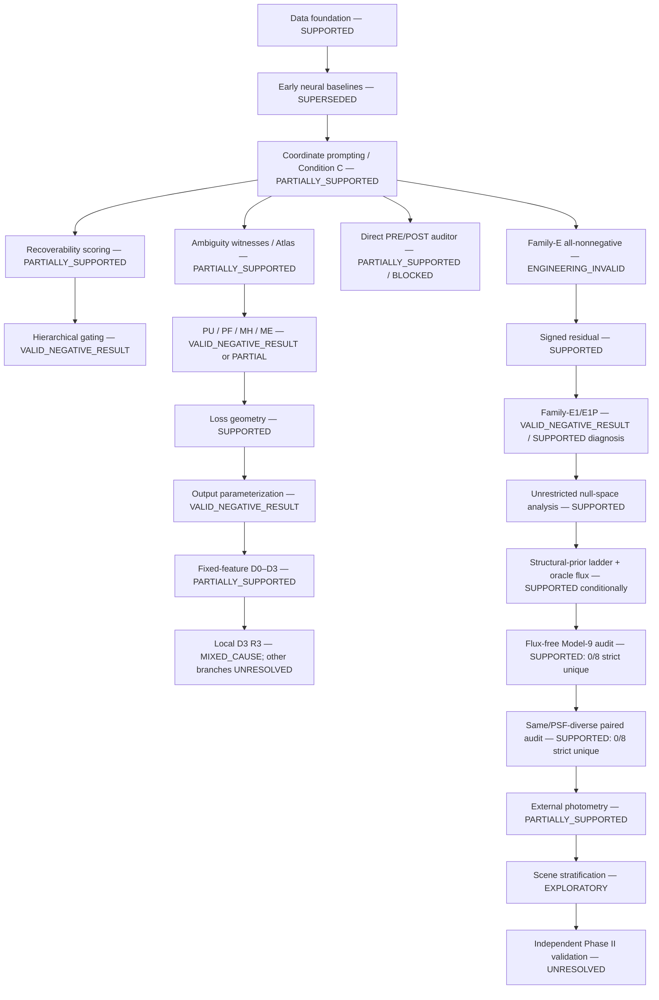

# Don’t Even Try: Complete Research Program Map

This document is the canonical scientific map for the Thayer program. It
resolves authority at the level of a claim, not by directory recency. Historical
reports are not rewritten: corrections and conflicts are recorded in the
[`supersession ledger`](research_archive/supersession_ledger.md), and the compact
evidence packages are indexed in the
[`experiment archive`](experiment_archive/README.md).

## 1. Executive summary

The project began by asking whether a compact neural network could remove a
companion galaxy from a blended image. It evolved after strong image metrics
failed to answer the more important question: whether a coordinate-requested
source was scientifically recoverable from the information supplied. The
program therefore moved from reconstruction performance, through promptability
and learned safety scores, to explicit identifiability audits and controlled
information interventions.

The strongest result is a boundary map, not a universal deblender. In the
frozen `3×60×60` two-source simulation contract, unrestricted additive source
allocation has an exact 10,800-dimensional null space. A hard structural model
with exact per-source g/r/z flux and truth-derived signed-noise information was
strictly unique in 7/8 selected scenes, but the valid nonoracle flux-free
contract was strictly unique in 0/8. The P2-versus-S1 composite
information/geometry criterion improved in 15/16 scene-family fits but restored
strict uniqueness in 0/8 scenes; after the same-PSF S2 control, only 3/16 gains
were PSF-specific. External total photometry was helpful relative to that P2
condition in Scenes 0, 5, 51, and 73
and not helpful in Scenes 3, 6, 18, and 81: 4/8, with exact 95% CI
15.7%–84.3%. The eight-scene low-`|ΔB/T|` separator is exploratory and
truth-derived, not an operational acquisition rule.

The coordinate prompt did change neural outputs—Condition C achieved 98.0%
prompt-swap success—but prompt response did not establish correct source
allocation. Probabilistic, multi-hypothesis, two-expert, output-constrained,
and calibration branches likewise did not create safe scientific coverage.
The current PRE audit is a useful research component, the explicit
identifiability audit is the strongest functioning layer, and the POST safety
classifier is blocked by an all-unsafe reconstruction population.

Phase I is complete only as an exploratory mechanistic map of the frozen eight
scenes. It does not estimate population prevalence, validate a survey policy,
or establish real-data performance. Phase II must hold starts, budgets,
thresholds, and hypotheses fixed on independent scenes that exclude the eight
discovery cases.

## 2. Research-question evolution

```text
Can a neural model deblend galaxies?
  → Can a coordinate prompt recover a requested galaxy?
  → Is the requested source uniquely determined?
  → Which priors or measurements change identifiability?
  → When should the system reconstruct, acquire more information, or abstain?
```

Each arrow is a correction in scientific target. Image similarity is still
useful, but it cannot decide whether one source allocation is determined by the
observation. Promptability establishes conditional control, not identity.
Identifiability asks whether admissible alternatives survive. The final
decision problem treats more information and abstention as valid outputs.

## 3. Definitions

- **Galaxy deblending:** inferring source-specific light from an observation
  containing overlapping astronomical sources.
- **Requested source:** the source associated with the query coordinate and the
  output the system is asked to return.
- **Companion source:** the other modeled source contributing to the blend.
- **Coordinate prompt:** a spatial channel, here a Gaussian centered on the
  requested coordinate, supplied with g/r/z blend channels.
- **Promptability:** measurable, source-dependent output change under a valid
  prompt intervention, including prompt swapping.
- **Source recovery:** agreement of the requested output with the corresponding
  isolated source under frozen scientific tolerances. Promptability alone is
  insufficient.
- **Forward consistency:** agreement between the observation and the sum or
  rendered combination of inferred components. It does not determine how flux
  is allocated between components.
- **Local identifiability:** uniqueness under infinitesimal perturbations around
  one endpoint, assessed with active Jacobian rank, nullity, curvature, and
  conditioning.
- **Global identifiability:** absence of scientifically distinct admissible
  endpoints across the frozen search, starts, families, and equivalences.
- **Null space:** parameter or output directions that leave the observation
  unchanged under the forward map.
- **Endpoint class:** a cluster of optimized solutions equivalent under the
  frozen scientific distance and assignment rules.
- **Scientific diameter:** the maximum scientifically relevant distance among
  admissible endpoints or classes.
- **Structural support:** the set of solutions admitted by the frozen physical
  and morphological model. Empty support is not uniqueness.
- **Recoverability frontier:** the boundary across information, prior, and
  model contracts separating unique, near-unique, partial, and non-identifiable
  behavior.
- **PRE audit:** a query-validity and ambiguity screen run before
  reconstruction.
- **Identifiability audit:** an explicit assessment using endpoint multiplicity,
  scientific diameter, rank/nullity, support, stability, and interventions.
- **POST audit:** a future classifier intended to decide whether a produced
  reconstruction is safe after inference.
- **Safe reconstruction:** a reconstruction authorized only when the query is
  valid, the target is globally identifiable under the declared contract, and
  validated error/safety requirements are satisfied. No current neural family
  establishes this operational standard.

## 4. Dataset and controlled inference contract

The early RGB benchmark used local Galaxy10 DECaLS HDF5 data and synthetic
blending. The structured Thayer program used CatSim/BTK-derived two-source
scenes, rendered g/r/z images, known coordinates, controlled PSFs and noise,
and isolated source truth available inside the simulator. The main mechanistic
set contains eight selected scenes (0, 3, 5, 6, 18, 51, 73, 81). Each source
image has shape `3×60×60`; the direct two-source output therefore has 21,600
degrees of freedom and the additive observation has 10,800 values.

The neural-scene pixel scale was 0.2 arcsec/pixel and its fixed g/r/z PSF FWHM
was 0.86/0.81/0.77 arcsec. Structured S1/S2/P2 fits used their frozen known
PSFs; nonoracle Model-9 used observation-derived plug-in noise, whereas the
oracle contract alone used truth-derived signed-noise subtraction. External
photometry used a frozen Gaussian 5% relative-uncertainty contract.

Split and access rules evolved with the program. Early random-row evaluation
was superseded by exact-pixel and exact-coordinate source-group disjoint
development splits. Later campaigns distinguished training/development,
Ambiguity Atlas, calibration, lockbox, and frozen mechanistic sets. Protected
tensors and hidden isolated truth remain local. Manifests, hashes, protocols,
and compact metric tables are the committable evidence.

Simulation truth had distinct roles:

| Information | Permitted role | Prohibited interpretation |
| --- | --- | --- |
| Isolated requested/companion images | Evaluation, witness construction, scientific distances, selected controlled oracle contracts | Ordinary deployment input |
| Source coordinates | Query and scene construction | Proof of source allocation |
| Exact per-source g/r/z flux | Explicit oracle-flux intervention only | Flux-free inference input |
| Truth-derived signed noise | Oracle structural contract only | Nonoracle survey information |
| Total/per-band external photometry | Explicit acquisition intervention with frozen uncertainty | Hidden free information in baseline fits |
| Morphology/truth features such as `|ΔB/T|` | Post-fit explanatory stratification | Validated operational routing rule |

The flux-free, same-PSF S2, PSF-diverse P2, and external-photometry conditions
were constructed to probe information boundaries. They are not all identical
except for one variable: notably, the oracle 7/8 and flux-free 0/8 contracts
differ in renderer, noise treatment, and scientific diameter gates as well as
photometric information. Their transition is central evidence, but not a clean
remove-photometry-only causal ablation.

Simulation was necessary for exact source truth, controlled counterfactual
observations, analytic forward maps, and witness construction. Those strengths
do not establish robustness to real morphology, PSF error, correlated noise,
catalog error, or survey selection. Real-survey generalization is unproven.

## 5. Full chronological timeline

The table groups repeated launch attempts that did not produce distinct
scientific results. Every one of the 124 top-level run directories is listed in
Section 27 and has a locator row in
[`experiment_ledger.csv`](research_archive/experiment_ledger.csv).

| Period | Campaign or branch | Question / authorized change | Governing outcome | Status |
| --- | --- | --- | --- | --- |
| Jul 8–9 | Direct U-Net, residual U-Net, balanced residual, BR v0.2/v0.3 | Can compact neural subtraction outperform the blend baseline? | Strong development metrics, but random-row leakage and reused evaluation prevented final evidence. | `SUPERSEDED` as clean evaluation |
| Jul 10 | Grouped correctness and grouped retrain | Enforce exact source-group disjointness. | Affected-region ratios 28.8127× normal, 15.8025× hard, 9.18304× compact, 15.8378× high-core; one grouped training seed and no untouched final pool. | `SUPPORTED` development-only |
| Jul 11 | BTK foundation | Establish reproducible simulated g/r/z source scenes and prompt semantics. | Engineering foundation passed; compact membership/provenance preserved. | `SUPPORTED` engineering |
| Jul 11 | Coordinate-prompt ablation / Condition C | Add a Gaussian coordinate channel. | 98.0% prompt-swap success and output collapse 0.002 under the frozen development contract; source recovery remained unresolved. | `PARTIALLY_SUPPORTED` |
| Jul 11 | Recoverability head and seed replication | Learn a scalar safety/recoverability score. | Ranking signal existed, but selective risk did not establish safe coverage. | `PARTIALLY_SUPPORTED` historical |
| Jul 11–12 | Calibration, scale, shape, observability, PSF and hierarchy attempts | Decompose or calibrate safety and ambiguity. | Hierarchical policy failed its deployment contract; later corrective report governs policy status. | `VALID_NEGATIVE_RESULT` |
| Jul 12 | Ambiguity witnesses and Atlas | Construct indistinguishable alternatives and test an operational detector. | Constructed witnesses 50/50; same-family model witnesses 19/50; detector AUROC 0.4712 and recall 0 at 4% FPR. | `SUPPORTED` witnesses; detector `FALSIFIED` |
| Jul 12 | Prompted ResUNet | Test whether more capacity and residual blocks repair recovery. | Failed promptability/recovery gates. | `VALID_NEGATIVE_RESULT` |
| Jul 12 | Probabilistic U-Net | Test stochastic candidate diversity. | 24/50 witnesses, AUROC 0.856, recall 0.32 at 4% FPR, but own/alternate truth coverage both zero. | `PARTIALLY_SUPPORTED` diversity only |
| Jul 12 | Conditional flow prior | Test posterior decoder sufficiency. | Failed prefit sufficiency; no reason to promote to full campaign. | `VALID_NEGATIVE_RESULT` |
| Jul 12 | Multi-hypothesis decoder | Emit a shared K=2 ambiguity set. | More hypotheses did not recover own or alternate truth. | `VALID_NEGATIVE_RESULT` |
| Jul 12 | Two-expert decoder | Separate decoders to encourage specialization. | Exact truth was representable, but learned experts did not establish required coverage. | `VALID_NEGATIVE_RESULT` |
| Jul 12 | Loss geometry and scientific alignment | Determine whether the objective destroys representable truths. | Full objective often preferred compromise; surrogate alignment did not repair the branch. | `SUPPORTED` mechanism; intervention negative |
| Jul 12–13 | Output conditioning, feasibility projection, fixed L0 output parameterization | Change output geometry without adding information. | Conditioning/feasibility changes did not establish source identity. | `VALID_NEGATIVE_RESULT` / partial diagnostics |
| Jul 13–14 | Repository integrity; fixed-feature D0–D3 | Is failure caused by output, decoder, or representation/optimization? | D0 square and D1 square passed both modes; D2 failed. D3 required a separate executable chain. | `SUPPORTED` D0–D2 map |
| Jul 13–14 | D3 contract, capsule, readiness, dtype, serialization, policy and launcher chain | Make one full-decoder scientific trajectory valid and replayable. | Many attempts failed closed before science; the final R3 entrypoint produced one valid local L0 result. | Mostly `ENGINEERING_INVALID`; final result supported locally |
| Jul 14 | D3 PV1-A1 R3 | Execute the frozen local L0 trajectory. | Budget exhausted at 5,000; own coverage passed (max 0.7153766), alternate failed (3.6737798), both failed; 5 assignment flips; `MIXED_CAUSE`. | `SUPPORTED` local result; other D3 branches unresolved |
| Jul 14 | Direct PRE/POST auditor | Test a direct catalog-safety policy. | PRE useful but missed formal macro-F1 gate; POST labels all unsafe, AUROC undefined, accepted coverage zero. | `PARTIALLY_SUPPORTED` PRE; POST blocked |
| Jul 14 | Family-E | Enforce nonnegative flux-conserving sources. | Contract invalid for signed noisy observations. | `ENGINEERING_INVALID` |
| Jul 14 | Signed-residual preflight | Add a signed residual/noise layer. | Restored representability and closure, not identity. | `SUPPORTED` physical correction |
| Jul 14 | Family-E1 | Train nonnegative sources plus signed residual. | Physical contract valid; scientific identity/recovery gates failed. | `VALID_NEGATIVE_RESULT` |
| Jul 14 | Family-E1P | Instrument paired prompt identity. | Prompt modulation survived, but prompt-swap was 0/1 difficult and 1/8 mixed; identity alignment remained weak. | `SUPPORTED` diagnosis |
| Jul 14 | PU eligibility / Jul 14 batch R1 correction | Repair single-versus-batch executor mismatch. | Repaired executor yielded 7,591 complete outputs, all 7,591 unsafe. | `SUPERSEDED` to eligible-but-label-collapsed |
| Jul 15 | Unrestricted recoverability analysis | Analyze the direct additive inverse. | Exact 10,800-dimensional allocation null space in every frozen scene. | `PROVEN_WITHIN_FROZEN_CONTRACT` |
| Jul 15 | Oracle structural prior ladder | Add hard morphology and exact source photometry/noise information. | Strict UNIQUE 7/8; Scene 51 out of support because its ~0.015 arcsec bulge was below the 0.03 arcsec bound. | `SUPPORTED` conditional/oracle |
| Jul 15 | First flux-free launch | Remove oracle flux under a new Model-9 contract. | Invalid, fail-closed; no scientific 0/8 evidence. | `ENGINEERING_INVALID` |
| Jul 15 | Model-9 preparation | Validate structured renderer/optimizer and frozen protocol. | Engineering foundation passed. | `SUPPORTED` engineering |
| Jul 15 | Valid flux-free identifiability | Fit morphology with source flux free. | 0/8 strict UNIQUE; best-family classifications 6 `NEAR_UNIQUE`, 2 `PARTIALLY_IDENTIFIABLE`. | `SUPPORTED` nonoracle baseline |
| Jul 17 | S1/S2/P2 PSF-diverse audit | Add a second same-PSF or PSF-diverse exposure. | P2 0/8 strict unique; composite gain 15/16, with S2 attribution 3/16 PSF-specific, 2/16 exposure-only, 11/16 no meaningful gain. | `SUPPORTED` paired-observation result |
| Jul 18 | External-photometry preflight | Add total and per-band source photometry on two scenes. | Preflight showed possible gain but exposed convergence limits. | `SUPERSEDED` preflight |
| Jul 18 | 500-evaluation correction | Increase two-scene convergence budget. | Corrected optimization interpretation; did not establish population behavior. | `SUPPORTED` correction |
| Jul 19 | Six-scene scene stratification | Test which scenes benefit from total photometry. | Six of eight scenes were interpretable; photometry was helpful for 3/6, while Scenes 5 and 18 were unresolved. | `SUPERSEDED` for complete count |
| Jul 19 | Eight-scene convergence correction | Resolve Scenes 5 and 18 at 2,000 evaluations. | Helpful 0,5,51,73; not helpful 3,6,18,81; 4/8. Low-`|ΔB/T|` rule exploratory. | `SUPPORTED` Phase-I map |
| Jul 19 | Canonical archive/evidence audit | Reconcile authority, curate evidence, inventory local data, and freeze validation plan. | Documentation and archive only; no scientific campaign rerun. | `SUPPORTED` synthesis |

## 6. Causal dependency graph



## 7. Full experiment ledger

The machine-readable ledger is
[`research_archive/experiment_ledger.csv`](research_archive/experiment_ledger.csv).
It contains one row for each of the 124 discovered run roots, plus the
repository-level null-space campaign, and every requested column. Forty-seven
claim-bearing run rows—including every provenance-backed curated run—and the
non-run analytic campaign are scientifically enriched from compact authorities.
Where another run lacks a
compact final authority, its fields remain explicit evidence locators or
`NOT_RECORDED` values and are not reconstructed from directory ordering. The
ledger is therefore a complete run/campaign locator and a partially extracted
scientific ledger; the condensed interpretation below and the
claim/supersession matrices govern claims.

| Campaign | Type | Central change | Final outcome | Authority |
| --- | --- | --- | --- | --- |
| Grouped correctness | Correction | Exact group-disjoint evaluation/retraining | Strong development ratios; no untouched final pool | Historical development authority |
| Condition C | Scientific | Coordinate-prompt channel | 98% prompt swap; no recovery proof | Promptability authority |
| Atlas | Diagnostic | Construct/recognize ambiguity witnesses | Witnesses exist; operational detector failed | Diagnostic authority |
| PU batch R1 | Correction | Frozen padded-batch executor | 7,591/7,591 unsafe | Deployment-executor authority |
| Loss geometry | Mechanistic | Audit full-objective trajectories | Truth representable; compromise preferred | Mechanistic authority |
| D3 R3 | Scientific/engineering | Valid local full-decoder trajectory | `MIXED_CAUSE` at 5,000-step budget | Local L0 authority |
| Family-E1P | Diagnostic | Paired prompt identity instrumentation | Prompt signal not identity-aligned | Prompt-mechanism authority |
| Unrestricted null space | Analytic | Direct allocation map | Nullity 10,800 per scene | Frozen-contract proof |
| Oracle flux | Scientific | Hard morphology + exact source flux/noise | 7/8 strict unique | Conditional oracle authority |
| Flux-free | Scientific | Source flux free | 0/8 strict unique | Nonoracle baseline authority |
| P2 | Scientific | Second PSF-diverse exposure with S2 control | 0/8 strict unique | Paired-observation authority |
| External photometry | Scientific/exploratory | Total source photometry | Helpful 4/8 relative to P2 | Phase-I exploratory authority |

## 8. Information-contract ladder

This ladder is the conceptual center of the program. Moving downward adds or
changes constraints or information; a result applies only to the row’s frozen
contract.

| Contract | Added information / restriction | Governing result | Interpretation |
| --- | --- | --- | --- |
| Unrestricted source pixels | Two arbitrary `3×60×60` source arrays whose sum matches the blend | Exact rank 10,800; nullity 10,800 | Allocation is non-identifiable in every frozen scene. |
| Nonnegativity | Both source layers nonnegative | Ambiguities remain; signed noisy observations may be outside an all-nonnegative exact-sum contract | Inequality constraints do not identify allocation and can make the target infeasible. |
| Smoothness / generic neural prior | Learned spatial regularity | Promptable and visually plausible outputs, but no own/alternate truth coverage guarantee | Weak priors select a solution; they do not prove it unique. |
| Flux constraints | Conservation or aggregate flux constraints | Physical closure can improve, identity remains unresolved | Aggregate constraints leave exchange directions. |
| Sérsic morphology | Parametric structural support | Some local/full-rank endpoints; no general global uniqueness result | Local support restriction is not a global proof. |
| Bulge+disk morphology | More expressive hard family | Used in oracle, flux-free, P2, and photometry ladders | Supports controlled fits; can also create multiple basins and misspecification. |
| Oracle component photometry | Exact per-source g/r/z flux plus truth-derived signed noise subtraction | 7/8 strict `UNIQUE`; Scene 51 out of structural support | Strong conditional upper-bound result, not ordinary inference. |
| Flux-free morphology | Source flux optimized from one observation | 0/8 strict `UNIQUE`; best family 6 near, 2 partial | Morphology without oracle source flux was insufficient on the frozen set. |
| Second same-PSF exposure (S2) | Added exposure without PSF diversity | Control for exposure/information volume | Needed to separate exposure from PSF-specific effects. |
| Second PSF-diverse exposure (P2) | Added exposure with different PSF | 0/8 strict unique; composite geometry gain 15/16 | Conditioning improved without restoring uniqueness. |
| External total photometry | Source-total measurement with frozen uncertainty | Helpful vs P2 in 0,5,51,73; not helpful in 3,6,18,81 | Scene-dependent multiplicity reduction; four-start fit limits comparability. |
| External per-band photometry | Per-band source measurements | Explored in preflight/correction, not selected as the Phase-I primary intervention | More detailed information did not receive a complete independent validation. |
| Scene-stratified response | Post-fit/truth feature analysis | `|ΔB/T|` cutoff 0.004913344229132974; AUC 1.0, p=.02857, BH q=.42857, LOO balanced accuracy .75, n=8 | Hypothesis generator only; independent validation unexecuted. |

The oracle-to-flux-free transition must be reported as “7/8 under the oracle
contract versus 0/8 under the valid flux-free contract,” with the non-clean
ablation qualification from Section 4. The 15/16 P2 figure is a composite
information/geometry result, not 15/16 unique scenes and not a pure PSF effect.

## 9. Promptability versus recoverability

Condition C appended a unit-peak Gaussian coordinate channel to the normalized
g/r/z blend. It achieved 98.0% prompt-swap success and collapse approximately
0.002 under its development contract, showing that the network used the
prompt. Yet whole-image or source-region source recovery could still fail:
many allocations can react to the coordinate while remaining inconsistent with
the isolated requested source.

Family-E1 repaired the physical signed-noise representation and retained prompt
conditioning, but failed the identity/recovery gates. Family-E1P then tested
the claim that paired prompts had been missing. They had not: E1 already used
paired A/B prompt views. Instrumented replication found nonzero prompt
gradients and layerwise modulation, while identity-aligned behavior remained
weak—difficult/mixed prompt-identity scores 0.5/0.5625 and prompt swaps 0/1 and
1/8. The prompt says *which position is requested*; it does not supply the
missing allocation of overlapping photons.

## 10. Local versus global identifiability

The active Jacobian measures first-order sensitivity around one fitted
endpoint. Full active rank and nullity zero can exclude an infinitesimal flat
direction there. Hessian eigenvalues and condition numbers describe local
curvature and numerical stability. None of these quantities rules out another
distant basin, a different endpoint class, support-boundary solution, or a
scientifically large diameter across starts.

Flux-free fits often reached locally full-rank endpoints while the scene-level
strict result remained 0/8 unique because multiple endpoint classes or failed
gradient/diameter gates survived. P2 improved local/composite geometry in
15/16 family fits without changing the scene-level strict uniqueness count.
Scene 81 is an explicit reminder that more or better-conditioned measurements
need not remove global alternatives. Conversely, external-photometry helpful
scenes reduced class multiplicity or diameter even when this did not create a
strict-unique classification. Local conditioning and global scientific
recoverability can therefore move independently or in opposite directions.

## 11. Model-family history

`Own` and `alternate` coverage mean whether the emitted candidate set covered
the frozen isolated truth and a valid competing truth. “None” is not a claim
that every historical row was measured identically; it means no governing
authority established safe positive support.

| Family | Output / prompt / stochasticity | Hypotheses | Forward consistency | Truth coverage and safe support | Final status |
| --- | --- | ---: | --- | --- | --- |
| Direct U-Net | Requested source; no coordinate prompt; deterministic | 1 | Not exact by construction | Development image metrics only | Historical baseline |
| Residual U-Net | Residual/requested source; no coordinate prompt; deterministic | 1 | Blend residual relation encouraged | No safe-support proof | Historical baseline |
| Balanced residual | Residual with balanced objective; deterministic | 1 | Approximate | Strong grouped development ratios; no final pool | Development-only |
| Condition C | Requested source; Gaussian coordinate prompt; deterministic | 1 | Not exact | Promptable; safe recovery unsupported | Partial positive for promptability |
| Recoverability head | Scalar risk on frozen reconstructions | 1 | Inherits base output | Ranking signal, no validated safe coverage | Historical partial |
| Hierarchy | Query/type/risk heads over frozen output | 1 | Inherits base output | Formal policy gate failed | Valid negative |
| Prompted ResUNet | Requested source; coordinate prompt; deterministic | 1 | Not exact | Failed promptability/recovery gate | Valid negative |
| PU | Stochastic requested-source samples | Many samples | Often high forward fraction in candidate diagnostics | 24/50 witnesses; own/alternate coverage 0/0 | Partial diversity, unsafe |
| PF | Conditional flow/posterior decoder | Stochastic latent | Planned | Prefit sufficiency failed | Valid negative prefit |
| MH | Shared encoder, K=2 hypotheses | 2 | Forward behavior reproduced | Own/near/cross-alternate coverage 0 | Valid negative |
| ME | Two independent expert decoders | 2 | Explicit requested+companion layers | Truth representable; learned coverage failed | Valid negative |
| Family-E | Nonnegative requested+companion(+nonnegative residual) | 1 | Exact-sum intended | Signed noisy target infeasible | Engineering invalid |
| Family-E1 | Nonnegative sources plus signed residual; prompted | 1 pair of prompt views | Exact closure representable | Identity/recovery gates failed | Valid negative |
| Family-E1P | Instrumented paired-prompt E1 replication | 1 pair | Same physical contract | Prompt survives but identity alignment weak | Mechanistic diagnosis |
| Direct structured Model-9 | Parametric Sérsic/bulge+disk fit; coordinates and declared measurements | Multi-start / family ladder | Explicit renderer and likelihood | Contract-dependent: oracle 7/8, flux-free 0/8, P2 0/8 | Current scientific workhorse |

## 12. Loss, representation, and optimization findings

The two-expert microset showed that exact truths could be represented, yet the
full training objective frequently preferred compromise outputs. Loss-geometry
audits found conflicts between source-specific scientific terms and aggregate
objectives; optimization could move away from truth coverage while lowering
the scalar objective. This falsified the simple inference that more decoder
capacity or more hypotheses would solve the scientific problem.

The fixed-feature ladder separated failure modes. D0 (directly optimize the
output) and D1 (square mapping over fixed features) passed both frozen modes;
D2 failed. The later D3 chain made a full-decoder local L0 trajectory executable
without rewriting the earlier result. Its R3 run exhausted 5,000 steps, passed
own coverage, failed alternate and joint coverage, underwent five assignment
flips, and mapped to `MIXED_CAUSE`. This is evidence about one local trajectory,
not the unexecuted eight-scene or capacity ladders, whose status remains
`UNKNOWN`.

The program therefore distinguishes:

- **Information limitation:** multiple source allocations or structural
  endpoints fit the declared observations.
- **Representation limitation:** the model cannot express the required truth
  or signed observation contract.
- **Objective limitation:** representable truth is not the optimizer’s preferred
  solution under the aggregate loss.
- **Optimization limitation:** finite starts or budgets fail to find or certify
  the best endpoint.

These can coexist. The external-photometry correction is explicitly
optimization-limited: external fits used four starts versus 16 for S1/P2, and
Scene 5 had only 1/4 optimizer-successful starts even at 2,000 evaluations.

## 13. Physical-contract corrections

A noisy observed image can contain negative background-subtracted pixels. Two
nonnegative source layers—and especially two nonnegative sources plus a
nonnegative residual—cannot exactly sum to every such observation. Family-E’s
all-nonnegative exact-conservation target was therefore physically infeasible,
so its negative result is engineering-invalid as a scientific recovery test.

The signed-residual contract uses nonnegative requested and companion light
with a signed residual/noise layer. It restored representability, exact closure,
and a meaningful physical decomposition contract. It did not label photons by
source, remove the additive null directions, force prompt identity, or create
own/alternate truth coverage. Family-E1/E1P supplied that negative evidence.

## 14. Audit-layer status

### PRE audit

The PRE audit is a working research component for query validity and ambiguity.
It was useful, but did not jointly clear the frozen validation/calibration
macro-F1 gate and is not an operational authorization policy.

### Identifiability audit

This is the strongest functioning audit. It combines multi-start endpoint
multiplicity, scientific diameters, active rank/nullity, support, stability,
and response to added information. Within frozen simulation contracts it can
support a fail-closed research decision; external operating characteristics are
unvalidated.

### POST safety classifier

POST is not operational. Repaired PU execution produced 7,591 complete outputs
and zero safe labels; the direct audit likewise found an all-unsafe population,
undefined AUROC, and zero accepted coverage. Calibration cannot manufacture a
safe-positive class. POST was not discarded conceptually; it remains blocked
until an eligible reconstruction family supplies nondegenerate, independently
validated labels.

```text
Input
  ↓
PRE query-validity audit
  ↓
Structured reconstruction
  ↓
Global identifiability audit
  ├── RECONSTRUCT
  ├── ACQUIRE PHOTOMETRY
  └── DON’T EVEN TRY
  ↓
Future POST audit
```

## 15. Major discoveries

| Rank | Discovery | Evidence | Expected? / confidence | Scope and limitation | Required validation |
| ---: | --- | --- | --- | --- | --- |
| 1 | Promptability is not recoverability. | Condition C 98% prompt swap; E1P signal without identity coverage | Surprising initially; high within tested families | Frozen simulated development contracts | Independent prompted-source accuracy with identity controls |
| 2 | Unrestricted additive allocation is non-identifiable. | Analytic `[I I]` map, rank 10,800, nullity 10,800, exact witnesses | Expected mathematically; proof-level | Direct two-source `3×60×60` contract | No empirical replication needed for the algebra; test robustness of richer forward models |
| 3 | Weak constraints do not remove ambiguity. | Nonnegativity, smooth neural priors, conservation, and output mappings failed to create coverage | Partly expected; strong support | Tested constraints/families only | Formal constraint-by-constraint analysis on independent scenes |
| 4 | Hard morphology appeared sufficient only with oracle source information. | Oracle structural ladder 7/8 strict unique | Surprising magnitude; moderate/high conditional confidence | Exact source flux and truth-derived noise; Scene 51 out of support | Matched implementation and misspecification tests |
| 5 | The valid flux-free contract was 0/8 strict unique versus oracle 7/8. | Oracle and flux-free final reports | Central and surprising; high descriptive confidence | Not a one-variable ablation; renderer/noise/gates differ | Matched remove-photometry ablation on independent scenes |
| 6 | PSF-diverse acquisition improved geometry without restoring uniqueness. | 15/16 composite gain; 0/8 strict unique; S2 attribution | Mixed result; high within contract | Composite includes added exposure; only 3/16 PSF-specific | Matched-depth independent S1/S2/P2 validation |
| 7 | External total photometry reduced multiplicity only for selected scenes. | Helpful 0,5,51,73; not 3,6,18,81 | Heterogeneity was expected; rate uncertain | n=8; four starts; Scene 5 convergence weak | Preregistered independent strata with equal starts/budgets |
| 8 | Local conditioning and global recoverability can diverge. | Locally full-rank flux-free fits, P2 conditioning gains, surviving endpoint classes | Scientifically important; high mechanistic confidence | Frozen structured solver and distances | Replicate with independent implementation and perturbations |
| 9 | Calibration cannot create coverage from all-unsafe outputs. | PU batch 0 safe/7,591; direct POST all unsafe | Expected once labels observed; high | These eligible neural outputs only | First obtain nondegenerate independently verified reconstructions |
| 10 | Recoverability is an information-and-prior frontier, not merely capacity. | Negative capacity/hypothesis branches plus oracle/flux-free/P2/photometry ladder | Emergent; strong support | Selected models and eight mechanistic scenes | Larger independent intervention ladder and real-data closure |

## 16. Falsified hypotheses

The following statements are falsified within their tested frozen branches;
none is promoted into a universal impossibility theorem.

| Hypothesis | Falsifying evidence |
| --- | --- |
| Stronger prompt conditioning is sufficient. | Prompted ResUNet and E1/E1P did not establish identity-aligned recovery. |
| Paired prompts were missing. | Family-E1 already used paired views; E1P instrumentation did not repair identity. |
| More hypotheses solve the problem. | K=2 MH and two-expert branches failed truth-coverage gates. |
| Stochastic latent models solve the problem. | PU gained witness diversity but own/alternate truth coverage was zero. |
| Separate experts solve the problem. | Truth was representable but learned expert coverage failed. |
| Output nonnegativity solves the problem. | It neither identifies allocation nor represents signed noisy observations alone. |
| Target infeasibility is the primary blocker. | Signed residual fixed feasibility; E1/E1P still failed identity/recovery. |
| Forward consistency implies scientific correctness. | Exact/additive closure admits null directions and wrong allocations. |
| Calibration is the next main bottleneck. | Label support collapsed before calibration: 0 safe/7,591. |
| Morphology alone restores uniqueness. | Valid flux-free morphology was 0/8 strict unique. |
| PSF diversity restores uniqueness. | P2 was 0/8 strict unique. |
| Local conditioning proves global recoverability. | Full local rank/better condition coexisted with multiple global endpoint classes. |
| POST calibration can rescue an all-unsafe population. | AUROC was undefined and accepted coverage zero in saturated labels. |

## 17. Remaining unknowns

- Independent-scene validation and population prevalence.
- Generalization to real surveys and real morphology.
- Sensitivity to prompt-coordinate error, PSF error, and noise
  misspecification.
- Structural-family misspecification, including out-of-support compact bulges.
- Whether the external-photometry response strata and low-`|ΔB/T|` rule
  reproduce independently.
- Direct reconstruction accuracy for targets proven unique without oracle
  source flux.
- Operating characteristics of a future POST audit with nondegenerate labels.
- The full D3 capacity ladder and eight-scene D3 branches, if revisited.
- Whether a practical observable can replace the truth-derived/post-fit
  stratification feature.
- Cost-sensitive performance of the reconstruct/acquire/abstain decision under
  survey resource constraints.

## 18. Contradiction and supersession ledger

The complete field-scoped record is
[`research_archive/supersession_ledger.md`](research_archive/supersession_ledger.md).

| Apparent contradiction | Resolution |
| --- | --- |
| Random-row success vs grouped evaluation | Grouped disjoint development metrics govern; historical random-row results remain leakage-affected history. |
| Atlas provisional vs corrected witnesses | Final report’s 50/50 constructed and 19/50 same-family counts govern. |
| PU ineligible vs eligible | Batch repair superseded executor status; scientific status is eligible-but-label-collapsed. |
| D3 unknown vs `MIXED_CAUSE` | One valid local L0 trajectory is mixed-cause; unrun branches remain unknown. |
| Unrestricted non-identifiability vs oracle uniqueness | Different support/information contracts; both results coexist. |
| Oracle 7/8 vs flux-free 0/8 | Both contract-specific; not a clean single-variable ablation. |
| P2 conditioning gain vs no uniqueness gain | Local/composite geometry is not global strict uniqueness. |
| Six-scene vs eight-scene photometry result | Convergence correction governs complete 4/8 count; six-scene analysis remains historical. |

## 19. Engineering and reproducibility history

Engineering campaigns were scientifically necessary because invalid execution
can masquerade as a result. The program introduced immutable hashes,
deterministic/canonical tensor hashing, frozen protocols and executors,
single-versus-batch geometry checks, checkpoint before/after inventories,
append-only run roots, atomic outputs, dtype and serialization contracts,
fail-closed policy mappers, and replay validators. The PU batch correction
changed eligibility without changing the all-unsafe scientific outcome. The D3
chain prevented incomplete launches from being counted as science and isolated
one valid local result.

Raw data, protected truth, dense endpoints, caches, and checkpoints remain
local and ignored. Compact authorities record source/archive hashes. Exact
training or inference replay requires those local artifacts and the historical
environment; the root dependency files are not a lockfile. Earlier random-row
benchmarks, provisional Atlas records, pre-correction hierarchy and PU executor
status, invalid flux-free launch, and failed D3 launches are historical only.
See the [`reproducibility index`](research_archive/reproducibility_index.md).

## 20. Key numbers

| Quantity | Verified value | Meaning |
| --- | ---: | --- |
| Direct allocation observation dimension | 10,800 | `3×60×60` blend values |
| Direct two-source parameter dimension | 21,600 | Two unrestricted source arrays |
| Exact allocation nullity | 10,800 | Per frozen scene under `[I I]` |
| Condition C prompt swap | 98.0% | Promptability, not recovery |
| Condition C collapse | 0.002 | Frozen promptability contract |
| Atlas constructed witnesses | 50/50 | Existence diagnostic |
| Atlas same-family model witnesses | 19/50 | Corrected count |
| Atlas detector AUROC / recall at 4% FPR | 0.4712 / 0 | Failed operational detector |
| PU witnesses / AUROC / recall at 4% FPR | 24/50 / 0.856 / 0.32 | Diversity without truth coverage |
| PU repaired outputs safe / unsafe | 0 / 7,591 | Eligible-but-label-collapsed |
| D3 R3 budget / assignment flips | 5,000 / 5 | Local `MIXED_CAUSE` trajectory |
| Oracle structural strict unique | 7/8 | Conditional on oracle source information |
| Flux-free strict unique | 0/8 | Best family 6 near, 2 partial |
| P2 strict unique | 0/8 | Paired PSF-diverse contract |
| P2 composite improvement | 15/16 | Scene-family fits; not pure PSF attribution |
| S2 attribution: PSF / exposure / none | 3 / 2 / 11 of 16 | Causal-control breakdown |
| External total photometry helpful | 4/8 | Scenes 0,5,51,73 vs P2 |
| Helpful-rate exact 95% CI | 15.7%–84.3% | Descriptive n=8 uncertainty |
| Low-`|ΔB/T|` cutoff | 0.004913344229132974 | Exploratory truth-derived rule |
| Rule AUC / p / BH q / LOO balanced accuracy | 1.0 / .02857 / .42857 / .75 | n=8, not operational |
| Grouped BR affected-MSE ratios | 28.8127× / 15.8025× / 9.18304× / 15.8378× | Normal / hard / compact / high-core development suites |

## 21. Figure index

| Use | Figure | Reason / disposition |
| --- | --- | --- |
| Poster, main paper | [Flux-free recoverability frontier](experiment_archive/flux_free_identifiability/key_figure.png) | Shows the nonoracle endpoint frontier. |
| Poster, main paper | [S1/S2/P2 frontier](experiment_archive/psf_diverse_identifiability/key_figure.png) | Separates conditioning improvement from uniqueness. |
| Poster, main paper | [Corrected information-source comparison](experiment_archive/scene_stratification_correction/key_figure.png) | Shows scene-dependent photometry response. |
| Main paper | [Grouped benchmark correction](experiment_archive/grouped_correctness/key_figure.png) | Documents clean development evaluation history. |
| Supplement | [Loss-gradient heatmap](experiment_archive/loss_geometry/key_figure.png) | Mechanistic objective conflict. |
| Supplement | [Family-E1P prompt diagnosis](experiment_archive/family_e1p/key_figure.png) | Prompt signal versus identity alignment. |
| Supplement | [Direct-audit risk curve](experiment_archive/direct_audit/key_figure.png) | PRE/POST policy failure context. |
| Supplement | [Atlas diameter plot](experiment_archive/ambiguity_atlas/key_figure.png) | Ambiguity-witness distribution. |
| Archive-only/local | Full endpoint grids, contact sheets, training diagnostics | Useful for audit, too dense or redundant for Git/publication. |
| Exclude | Isolated/hidden truth-panel grids, raw rendered scenes, >5 MB diagnostics, duplicates | Protection, size, or redundancy. |

## 22. Poster-ready narrative

**Question:** When is a coordinate-requested galaxy actually determined by a
blend? **Finding:** prompts can steer a network without identifying the true
source. The unrestricted inverse has an exact 10,800-dimensional allocation
null space. Strong morphology plus oracle source information was 7/8 unique;
the valid flux-free contract was 0/8. A PSF-diverse second observation improved
geometry but remained 0/8 unique. Total photometry helped four of eight
selected scenes, suggesting a scene-dependent information frontier. **Decision
concept:** PRE-screen the query, reconstruct structurally, audit global
identifiability, then reconstruct, acquire photometry, or “don’t even try.”
Independent validation is the next step.

## 23. Paper-ready claims

### Safe claims

- The unrestricted additive two-source inverse has an exact
  10,800-dimensional null space in the frozen `3×60×60` contract.
- Coordinate promptability did not guarantee identity-aligned source recovery
  in the tested neural families.
- Flux-free and P2 structured contracts produced 0/8 strict-unique scenes.
- External total photometry was helpful relative to P2 in four of the eight
  selected Phase-I scenes.

### Qualified claims

- Oracle source photometry and hard morphology produced 7/8 strict uniqueness
  **within that oracle contract**.
- P2 improved a composite information/geometry metric in 15/16 fits, while the
  S2 control attributes only 3/16 specifically to PSF diversity.
- Low `|ΔB/T|` is a candidate mechanism for photometry benefit, not a validated
  routing feature.
- The identifiability audit supports fail-closed research decisions in frozen
  simulations, not deployed survey safety.

### Prohibited claims

- “Galaxy deblending is impossible.”
- “Removing photometry alone caused 7/8 to become 0/8.”
- “PSF diversity is useless” or “PSF diversity solved 15/16 fits.”
- “Photometry solves half of survey blends.”
- “The low-`|ΔB/T|` rule is a validated acquisition policy.”
- “The current POST classifier safely authorizes reconstructions.”

### Candidate novelty claims

- A controlled recoverability frontier joining analytic null spaces, global
  multi-start endpoints, and acquisition interventions.
- Empirical separation of promptability, local conditioning, and global source
  identifiability.
- A reconstruct/acquire/abstain framing driven by evidence about information
  sufficiency rather than only predictive uncertainty.

### Claims requiring validation

The prevalence of each frontier class, generalization of photometry benefit,
an observable routing feature, robustness to modeling error, reconstruction
accuracy in independently unique cases, and any real-survey safety claim.

## 24. Phase I completion status

Phase I exploratory recoverability map is complete for the frozen eight-scene
mechanistic set.

“Complete” means that the planned S1/flux-free, S2/P2, and external-total-
photometry discovery interventions have reconciled authorities for all eight
scenes. It does not mean independent validation or population inference is
complete.

## 25. Phase II validation

Independent-scene validation remains unexecuted.

The frozen plan is in
[`research_archive/phase_ii_validation_plan.md`](research_archive/phase_ii_validation_plan.md).
It excludes the eight discovery scenes, uses the single-observation flux-free
condition as baseline, total photometry as the primary intervention, P2 as a
comparator, equal starts/budgets, frozen thresholds, binomial uncertainty,
prespecified tests and multiplicity correction, and no post-hoc threshold
tuning.

## 26. Reproduction guide

1. Read the [claim authority matrix](research_archive/claim_authority_matrix.md)
   and [supersession ledger](research_archive/supersession_ledger.md) before
   combining values across campaigns.
2. Verify compact evidence through each campaign’s `SOURCE_PROVENANCE.md` and
   the [reproducibility index](research_archive/reproducibility_index.md).
3. Parse all archive JSON/CSV and recompute headline counts from the committed
   summary tables; do not treat archive tables as model inputs.
4. Reproduce the analytic direct-allocation proof from
   [the null-space report](experiment_archive/recoverability_nullspace/final_report.md).
5. For exact structured analysis replay, restore the ignored local observations
   and use the frozen Model-9/flux-free/P2/photometry protocols, manifests,
   hashes, starts, and thresholds. Do not substitute oracle information into a
   nonoracle condition.
6. For neural inference/training replay, restore the local checkpoint and scene
   artifacts whose hashes are recorded by the campaign. They are intentionally
   not in Git.
7. Treat the root dependency files as broad requirements, not an exact lock;
   campaign reports/manifests are the available environment records.
8. Phase II requires a fresh independent scene manifest and must not reuse the
   eight Phase-I scenes for validation.

## 27. Complete run-directory appendix

The following table is generated from the 124 run-root rows of the 125-record
experiment ledger. Authority is deliberately conservative when a run has no
compact final report.

<!-- RUN_DIRECTORY_APPENDIX -->

| Timestamp | Run directory | Type | Authority status | Supersession status | Git evidence |
| --- | --- | --- | --- | --- | --- |
| 20260708T184454 | `balanced_residual_20260708_184454` | `scientific` | `ENGINEERING_OR_INCOMPLETE_RECORD` | `LATER_SAME_STEM_EXISTS_REVIEW_SUPERSESSION_LEDGER` | `ledger_only` |
| 20260708T184544 | `balanced_residual_20260708_184544` | `scientific` | `ENGINEERING_OR_INCOMPLETE_RECORD` | `LATER_SAME_STEM_EXISTS_REVIEW_SUPERSESSION_LEDGER` | `ledger_only` |
| 20260708T184632 | `balanced_residual_20260708_184632` | `scientific` | `ENGINEERING_OR_INCOMPLETE_RECORD` | `REVIEW_SUPERSESSION_LEDGER` | `ledger_only` |
| 20260710T110917 | `br_v02_moderate_grouped_retrain_20260710_110917` | `scientific_or_engineering` | `ENGINEERING_OR_INCOMPLETE_RECORD` | `REVIEW_SUPERSESSION_LEDGER` | `ledger_only` |
| 20260709T203034 | `br_v03_delta_candidate_20260709_203034` | `scientific_or_engineering` | `ENGINEERING_OR_INCOMPLETE_RECORD` | `LATER_SAME_STEM_EXISTS_REVIEW_SUPERSESSION_LEDGER` | `ledger_only` |
| 20260710T031425 | `br_v03_delta_candidate_20260710_031425` | `scientific_or_engineering` | `ENGINEERING_OR_INCOMPLETE_RECORD` | `REVIEW_SUPERSESSION_LEDGER` | `ledger_only` |
| 20260709T185630 | `br_v03_delta_color_20260709_185630` | `scientific_or_engineering` | `ENGINEERING_OR_INCOMPLETE_RECORD` | `REVIEW_SUPERSESSION_LEDGER` | `ledger_only` |
| 20260710T032839 | `clean_benchmark_plan_20260710_032839` | `scientific_or_engineering` | `ENGINEERING_OR_INCOMPLETE_RECORD` | `REVIEW_SUPERSESSION_LEDGER` | `ledger_only` |
| 20260710T063312 | `clipping_audit_20260710_063312` | `preflight_or_engineering` | `REPORT_PRESENT_REVIEW_AUTHORITY_MATRIX` | `LATER_SAME_STEM_EXISTS_REVIEW_SUPERSESSION_LEDGER` | `ledger_only` |
| 20260710T075442 | `clipping_audit_20260710_075442` | `preflight_or_engineering` | `REPORT_PRESENT_REVIEW_AUTHORITY_MATRIX` | `REVIEW_SUPERSESSION_LEDGER` | `ledger_only` |
| 20260711T024415 | `dr10_foundation_20260711_024415` | `engineering` | `ENGINEERING_REAL_SKY_FOUNDATION` | `BTK_REPLACES_CONTROLLED_TRAINING_ROUTE; DR10_REMAINS_FUTURE_OOD_ROUTE` | `ledger_only` |
| 20260711T155820 | `dr10_model_probe_20260711_155820` | `scientific_or_engineering` | `ENGINEERING_OR_INCOMPLETE_RECORD` | `LATER_SAME_STEM_EXISTS_REVIEW_SUPERSESSION_LEDGER` | `ledger_only` |
| 20260711T160018 | `dr10_model_probe_20260711_160018` | `preflight` | `VALID_NEGATIVE_REAL_CUTOUT_PREFLIGHT` | `160018_TABLES_SUPERSEDE_155820_SCALARS; BTK_GOVERNS_CONTROLLED_DATA` | `ledger_only` |
| 20260708T215421 | `evaluation_audit_20260708_215421` | `engineering` | `ENGINEERING_OR_INCOMPLETE_RECORD` | `LATER_SAME_STEM_EXISTS_REVIEW_SUPERSESSION_LEDGER` | `ledger_only` |
| 20260708T220833 | `evaluation_audit_20260708_220833` | `preflight_or_engineering` | `REPORT_PRESENT_REVIEW_AUTHORITY_MATRIX` | `REVIEW_SUPERSESSION_LEDGER` | `ledger_only` |
| 20260710T065316 | `final_checkpoint_integrity_20260710_065316` | `engineering` | `ENGINEERING_OR_INCOMPLETE_RECORD` | `REVIEW_SUPERSESSION_LEDGER` | `ledger_only` |
| 20260710T060845 | `final_test_manifest_prep_20260710_060845` | `engineering` | `ENGINEERING_OR_INCOMPLETE_RECORD` | `LATER_SAME_STEM_EXISTS_REVIEW_SUPERSESSION_LEDGER` | `ledger_only` |
| 20260710T061737 | `final_test_manifest_prep_20260710_061737` | `engineering` | `ENGINEERING_OR_INCOMPLETE_RECORD` | `REVIEW_SUPERSESSION_LEDGER` | `ledger_only` |
| 20260710T063746 | `final_test_manifest_prep_conservative_exclusion_setup_20260710_063746` | `engineering` | `ENGINEERING_OR_INCOMPLETE_RECORD` | `REVIEW_SUPERSESSION_LEDGER` | `ledger_only` |
| 20260710T063312 | `preservation_null_tests_20260710_063312` | `scientific_or_engineering` | `ENGINEERING_OR_INCOMPLETE_RECORD` | `LATER_SAME_STEM_EXISTS_REVIEW_SUPERSESSION_LEDGER` | `ledger_only` |
| 20260710T075442 | `preservation_null_tests_20260710_075442` | `scientific_or_engineering` | `ENGINEERING_OR_INCOMPLETE_RECORD` | `REVIEW_SUPERSESSION_LEDGER` | `ledger_only` |
| 20260710T092241 | `research_correctness_audit_20260710_092241` | `correction` | `HISTORICAL_GROUPED_DEVELOPMENT_AUTHORITY` | `SUPERSEDES_RANDOM_ROW_DEVELOPMENT_CLAIMS_AND_PROVISIONAL_FINAL_POOL` | `curated_compact_copy` |
| 20260708T154947 | `residual_unet_20260708_154947` | `scientific` | `ENGINEERING_OR_INCOMPLETE_RECORD` | `REVIEW_SUPERSESSION_LEDGER` | `ledger_only` |
| 20260710T043109 | `resunet_v04_candidate_20260710_043109` | `scientific` | `ENGINEERING_OR_INCOMPLETE_RECORD` | `REVIEW_SUPERSESSION_LEDGER` | `ledger_only` |
| 20260709T102251 | `size_visual_audit_20260709_102251` | `engineering` | `ENGINEERING_OR_INCOMPLETE_RECORD` | `REVIEW_SUPERSESSION_LEDGER` | `ledger_only` |
| 20260710T061059 | `source_artifact_audit_20260710_061059` | `preflight_or_engineering` | `REPORT_PRESENT_REVIEW_AUTHORITY_MATRIX` | `REVIEW_SUPERSESSION_LEDGER` | `ledger_only` |
| 20260710T060927 | `source_leakage_audit_20260710_060927` | `engineering` | `ENGINEERING_OR_INCOMPLETE_RECORD` | `LATER_SAME_STEM_EXISTS_REVIEW_SUPERSESSION_LEDGER` | `ledger_only` |
| 20260710T062157 | `source_leakage_audit_20260710_062157` | `engineering` | `ENGINEERING_OR_INCOMPLETE_RECORD` | `LATER_SAME_STEM_EXISTS_REVIEW_SUPERSESSION_LEDGER` | `ledger_only` |
| 20260710T062950 | `source_leakage_audit_20260710_062950` | `preflight_or_engineering` | `REPORT_PRESENT_REVIEW_AUTHORITY_MATRIX` | `REVIEW_SUPERSESSION_LEDGER` | `ledger_only` |
| 20260708T051648 | `stress_test_20260708_051648` | `scientific` | `ENGINEERING_OR_INCOMPLETE_RECORD` | `LATER_SAME_STEM_EXISTS_REVIEW_SUPERSESSION_LEDGER` | `ledger_only` |
| 20260708T141153 | `stress_test_20260708_141153` | `scientific` | `ENGINEERING_OR_INCOMPLETE_RECORD` | `LATER_SAME_STEM_EXISTS_REVIEW_SUPERSESSION_LEDGER` | `ledger_only` |
| 20260708T145221 | `stress_test_20260708_145221` | `scientific` | `ENGINEERING_OR_INCOMPLETE_RECORD` | `REVIEW_SUPERSESSION_LEDGER` | `ledger_only` |
| 20260712T145627 | `thayer_ambiguity_atlas_v0_20260712_145627` | `scientific` | `AUTHORITATIVE_AMBIGUITY_DIAGNOSTIC_RESULT` | `FINAL_REPORT_CORRECTED_COUNTS_GOVERN; PU_IS_NEW_FAMILY_NOT_CORRECTION` | `curated_compact_copy` |
| 20260714T154655 | `thayer_audit_v0_20260714_154655` | `scientific` | `VALID_PARTIAL_DIRECT_AUDIT_RESULT` | `ADDENDUM_CORRECTS_FINAL_CLASS_TOKEN; SATURATED_POST_METRICS_NONDISCRIMINATIVE` | `curated_compact_copy` |
| 20260713T145040 | `thayer_authoritative_d3_20260713_145040` | `engineering_invalid` | `ENGINEERING_HISTORY_NO_DISTINCT_SCIENTIFIC_AUTHORITY` | `R3_SUPERSEDES_D3_NOT_RUN_CURRENT_STATUS; INCIDENT_HISTORY_RETAINED` | `ledger_only` |
| 20260714T070916 | `thayer_authoritative_scientific_d3_20260714_070916` | `engineering_invalid` | `ENGINEERING_HISTORY_NO_DISTINCT_SCIENTIFIC_AUTHORITY` | `R3_SUPERSEDES_D3_NOT_RUN_CURRENT_STATUS; INCIDENT_HISTORY_RETAINED` | `ledger_only` |
| 20260713T005215 | `thayer_capacity_ladder_20260713_005215` | `scientific_or_engineering` | `REPORT_PRESENT_REVIEW_AUTHORITY_MATRIX` | `LATER_SAME_STEM_EXISTS_REVIEW_SUPERSESSION_LEDGER` | `ledger_only` |
| 20260713T013132 | `thayer_capacity_ladder_20260713_013132` | `preflight` | `ENGINEERING_PREFLIGHT_STOP` | `SUPERSEDES_20260713_005215_INCOMPLETE_CHECKPOINT_INVENTORY` | `ledger_only` |
| 20260713T161342 | `thayer_capsule_authoritative_d3_20260713_161342` | `engineering_invalid` | `ENGINEERING_HISTORY_NO_DISTINCT_SCIENTIFIC_AUTHORITY` | `R3_SUPERSEDES_D3_NOT_RUN_CURRENT_STATUS; INCIDENT_HISTORY_RETAINED` | `ledger_only` |
| 20260712T131111 | `thayer_competing_hypotheses_20260712_131111` | `scientific` | `AUTHORITATIVE_AMBIGUITY_FEASIBILITY_RESULT` | `ATLAS_SUPERSEDES_PROVISIONAL_OPERATIONAL_EVALUATION_NOT_WITNESS_EXISTENCE` | `ledger_only` |
| 20260713T113715 | `thayer_d1_endpoint_replay_20260713_113715` | `engineering_invalid` | `ENGINEERING_HISTORY_NO_DISTINCT_SCIENTIFIC_AUTHORITY` | `R3_SUPERSEDES_D3_NOT_RUN_CURRENT_STATUS; INCIDENT_HISTORY_RETAINED` | `ledger_only` |
| 20260714T020758 | `thayer_d3_alignment_r1_20260714_020758` | `engineering_invalid` | `ENGINEERING_HISTORY_NO_DISTINCT_SCIENTIFIC_AUTHORITY` | `R3_SUPERSEDES_D3_NOT_RUN_CURRENT_STATUS; INCIDENT_HISTORY_RETAINED` | `ledger_only` |
| 20260713T162704 | `thayer_d3_executable_contract_20260713_162704` | `engineering_invalid` | `ENGINEERING_HISTORY_NO_DISTINCT_SCIENTIFIC_AUTHORITY` | `R3_SUPERSEDES_D3_NOT_RUN_CURRENT_STATUS; INCIDENT_HISTORY_RETAINED` | `ledger_only` |
| 20260713T164243 | `thayer_d3_executable_contract_20260713_164243` | `engineering_invalid` | `ENGINEERING_HISTORY_NO_DISTINCT_SCIENTIFIC_AUTHORITY` | `R3_SUPERSEDES_D3_NOT_RUN_CURRENT_STATUS; INCIDENT_HISTORY_RETAINED` | `ledger_only` |
| 20260713T164320 | `thayer_d3_executable_contract_20260713_164320` | `engineering_invalid` | `ENGINEERING_HISTORY_NO_DISTINCT_SCIENTIFIC_AUTHORITY` | `R3_SUPERSEDES_D3_NOT_RUN_CURRENT_STATUS; INCIDENT_HISTORY_RETAINED` | `ledger_only` |
| 20260714T012539 | `thayer_d3_hash_r1_20260714_012539` | `engineering_invalid` | `ENGINEERING_HISTORY_NO_DISTINCT_SCIENTIFIC_AUTHORITY` | `R3_SUPERSEDES_D3_NOT_RUN_CURRENT_STATUS; INCIDENT_HISTORY_RETAINED` | `ledger_only` |
| 20260713T221426 | `thayer_d3_i41r1_20260713_221426` | `engineering_invalid` | `ENGINEERING_HISTORY_NO_DISTINCT_SCIENTIFIC_AUTHORITY` | `R3_SUPERSEDES_D3_NOT_RUN_CURRENT_STATUS; INCIDENT_HISTORY_RETAINED` | `ledger_only` |
| 20260713T182315 | `thayer_d3_integration_science_20260713_182315` | `engineering_invalid` | `ENGINEERING_HISTORY_NO_DISTINCT_SCIENTIFIC_AUTHORITY` | `R3_SUPERSEDES_D3_NOT_RUN_CURRENT_STATUS; INCIDENT_HISTORY_RETAINED` | `ledger_only` |
| 20260713T224729 | `thayer_d3_onego_20260713_224729` | `engineering_invalid` | `ENGINEERING_HISTORY_NO_DISTINCT_SCIENTIFIC_AUTHORITY` | `R3_SUPERSEDES_D3_NOT_RUN_CURRENT_STATUS; INCIDENT_HISTORY_RETAINED` | `ledger_only` |
| 20260713T173955 | `thayer_d3_policy_contract_20260713_173955` | `engineering_invalid` | `ENGINEERING_HISTORY_NO_DISTINCT_SCIENTIFIC_AUTHORITY` | `R3_SUPERSEDES_D3_NOT_RUN_CURRENT_STATUS; INCIDENT_HISTORY_RETAINED` | `ledger_only` |
| 20260714T074016 | `thayer_d3_protocol_readiness_r1_20260714_074016` | `engineering_invalid` | `ENGINEERING_HISTORY_NO_DISTINCT_SCIENTIFIC_AUTHORITY` | `R3_SUPERSEDES_D3_NOT_RUN_CURRENT_STATUS; INCIDENT_HISTORY_RETAINED` | `ledger_only` |
| 20260714T161723 | `thayer_d3_pv1_readiness_r1_20260714_161723` | `engineering_invalid` | `ENGINEERING_HISTORY_NO_DISTINCT_SCIENTIFIC_AUTHORITY` | `R3_SUPERSEDES_D3_NOT_RUN_CURRENT_STATUS; INCIDENT_HISTORY_RETAINED` | `ledger_only` |
| 20260714T175200 | `thayer_d3_pv1a1_entrypoint_r3_20260714_175200` | `scientific` | `AUTHORITATIVE_LOCAL_L0_D3_RESULT` | `SUPERSEDES_STALE_D3_NOT_RUN_STATUS; UNRUN_BRANCHES_REMAIN_UNKNOWN` | `curated_compact_copy` |
| 20260714T165947 | `thayer_d3_pv1a1_readiness_r2_20260714_165947` | `engineering_invalid` | `ENGINEERING_HISTORY_NO_DISTINCT_SCIENTIFIC_AUTHORITY` | `R3_SUPERSEDES_D3_NOT_RUN_CURRENT_STATUS; INCIDENT_HISTORY_RETAINED` | `ledger_only` |
| 20260713T125352 | `thayer_d3_runtime_readiness_20260713_125352` | `engineering_invalid` | `ENGINEERING_HISTORY_NO_DISTINCT_SCIENTIFIC_AUTHORITY` | `R3_SUPERSEDES_D3_NOT_RUN_CURRENT_STATUS; INCIDENT_HISTORY_RETAINED` | `ledger_only` |
| 20260713T130859 | `thayer_d3_runtime_readiness_20260713_130859` | `engineering_invalid` | `ENGINEERING_HISTORY_NO_DISTINCT_SCIENTIFIC_AUTHORITY` | `R3_SUPERSEDES_D3_NOT_RUN_CURRENT_STATUS; INCIDENT_HISTORY_RETAINED` | `ledger_only` |
| 20260713T131306 | `thayer_d3_runtime_readiness_20260713_131306` | `engineering_invalid` | `ENGINEERING_HISTORY_NO_DISTINCT_SCIENTIFIC_AUTHORITY` | `R3_SUPERSEDES_D3_NOT_RUN_CURRENT_STATUS; INCIDENT_HISTORY_RETAINED` | `ledger_only` |
| 20260713T134646 | `thayer_d3_runtime_readiness_20260713_134646` | `engineering_invalid` | `ENGINEERING_HISTORY_NO_DISTINCT_SCIENTIFIC_AUTHORITY` | `R3_SUPERSEDES_D3_NOT_RUN_CURRENT_STATUS; INCIDENT_HISTORY_RETAINED` | `ledger_only` |
| 20260713T135017 | `thayer_d3_runtime_readiness_20260713_135017` | `engineering_invalid` | `ENGINEERING_HISTORY_NO_DISTINCT_SCIENTIFIC_AUTHORITY` | `R3_SUPERSEDES_D3_NOT_RUN_CURRENT_STATUS; INCIDENT_HISTORY_RETAINED` | `ledger_only` |
| 20260713T153815 | `thayer_d3_scientific_capsule_20260713_153815` | `engineering_invalid` | `ENGINEERING_HISTORY_NO_DISTINCT_SCIENTIFIC_AUTHORITY` | `R3_SUPERSEDES_D3_NOT_RUN_CURRENT_STATUS; INCIDENT_HISTORY_RETAINED` | `ledger_only` |
| 20260713T155637 | `thayer_d3_scientific_capsule_20260713_155637` | `engineering_invalid` | `ENGINEERING_HISTORY_NO_DISTINCT_SCIENTIFIC_AUTHORITY` | `R3_SUPERSEDES_D3_NOT_RUN_CURRENT_STATUS; INCIDENT_HISTORY_RETAINED` | `ledger_only` |
| 20260714T024423 | `thayer_d3_semantic_path_r1_20260714_024423` | `engineering_invalid` | `ENGINEERING_HISTORY_NO_DISTINCT_SCIENTIFIC_AUTHORITY` | `R3_SUPERSEDES_D3_NOT_RUN_CURRENT_STATUS; INCIDENT_HISTORY_RETAINED` | `ledger_only` |
| 20260713T200621 | `thayer_d3_v41_science_20260713_200621` | `engineering_invalid` | `ENGINEERING_HISTORY_NO_DISTINCT_SCIENTIFIC_AUTHORITY` | `R3_SUPERSEDES_D3_NOT_RUN_CURRENT_STATUS; INCIDENT_HISTORY_RETAINED` | `ledger_only` |
| 20260718T205638 | `thayer_external_photometry_convergence_correction_v0_20260718_205638` | `correction` | `AUTHORITATIVE_TWO_SCENE_CORRECTION` | `SUPERSEDES_PREFLIGHT_OPTIMIZATION_INTERPRETATION_ONLY` | `curated_compact_copy` |
| 20260718T154852 | `thayer_external_photometry_preflight_v0_20260718_154852` | `preflight` | `PROVISIONAL_PREFLIGHT_EVIDENCE` | `FIT_INTERPRETATIONS_SUPERSEDED_BY_20260718_205638; MEASUREMENTS_RETAINED` | `curated_compact_copy` |
| 20260719T011606 | `thayer_external_photometry_scene_stratification_v0_20260719_011606` | `scientific` | `AUTHORITATIVE_FOR_SIX_RESOLVED_LABELS; FEATURE_ANALYSIS_EXPLORATORY` | `SCENES_5_18_AND_AGGREGATE_SUPERSEDED_BY_20260719_030954` | `curated_compact_copy` |
| 20260719T030954 | `thayer_external_photometry_stratification_convergence_correction_v0_20260719_030954` | `correction` | `AUTHORITATIVE_CORRECTED_PHASE_I_AGGREGATE; FEATURE_INFERENCE_EXPLORATORY` | `SUPERSEDES_ONLY_SCENES_5_18_UNRESOLVED_LABELS_AND_INCOMPLETE_AGGREGATE` | `curated_compact_copy` |
| 20260714T202340 | `thayer_family_e1_signed_noise_residual_preflight_v0_20260714_202340` | `preflight` | `AUTHORITATIVE_PHYSICAL_CONTRACT_CORRECTION` | `SUPERSEDES_ONLY_THE_PHYSICAL_REPRESENTATION_ELEMENT` | `curated_compact_copy` |
| 20260714T214638 | `thayer_family_e1_v0_20260714_214638` | `engineering_invalid` | `ENGINEERING_HISTORY_NO_DISTINCT_SCIENTIFIC_AUTHORITY` | `LATER_VALID_SAME_STEM_RUN_GOVERNS_SCIENCE` | `ledger_only` |
| 20260714T214715 | `thayer_family_e1_v0_20260714_214715` | `scientific` | `VALID_NEGATIVE_FAMILY_E1_RESULT` | `214638_FAILED_BOOTSTRAP; 214715_AUTHORITATIVE` | `curated_compact_copy` |
| 20260714T225228 | `thayer_family_e1p_v0_20260714_225228` | `scientific` | `AUTHORITATIVE_PROMPT_IDENTITY_DIAGNOSIS` | `COMPLEMENTS_E1; CORRECTS_MISSING_PAIRED_EXAMPLES_MECHANISM` | `curated_compact_copy` |
| 20260714T195256 | `thayer_family_e_v0_20260714_195256` | `engineering_invalid` | `ENGINEERING_INVALID_PHYSICAL_CONTRACT` | `FAILURE_REMAINS_CORRECT_FOR_ITS_CONTRACT; E1_CHANGES_CONTRACT_ONLY` | `curated_compact_copy` |
| 20260712T234216 | `thayer_feasibility_projection_20260712_234216` | `scientific` | `VALID_PROJECTION_RESULT_AND_INVALID_NEURAL_CONTINUATION` | `CORRECTED_P0_AUTHORITATIVE; P1_REJECTED_BY_ADDENDA` | `curated_compact_copy` |
| 20260713T181323 | `thayer_final_authoritative_d3_20260713_181323` | `engineering_invalid` | `ENGINEERING_HISTORY_NO_DISTINCT_SCIENTIFIC_AUTHORITY` | `R3_SUPERSEDES_D3_NOT_RUN_CURRENT_STATUS; INCIDENT_HISTORY_RETAINED` | `ledger_only` |
| 20260713T181323 | `thayer_final_authoritative_d3_policy_preflight_20260713_181323` | `engineering_invalid` | `ENGINEERING_HISTORY_NO_DISTINCT_SCIENTIFIC_AUTHORITY` | `R3_SUPERSEDES_D3_NOT_RUN_CURRENT_STATUS; INCIDENT_HISTORY_RETAINED` | `ledger_only` |
| 20260713T025737 | `thayer_fixed_feature_audit_20260713_025737` | `preflight_or_engineering` | `REPORT_PRESENT_REVIEW_AUTHORITY_MATRIX` | `REVIEW_SUPERSESSION_LEDGER` | `ledger_only` |
| 20260712T182516 | `thayer_flow_prior_20260712_182516` | `preflight` | `VALID_NEGATIVE_PREFIT_RESULT` | `CURRENT_FOR_FLOW_BRANCH` | `curated_compact_copy` |
| 20260715T152950 | `thayer_flux_free_identifiability_v0_20260715_152950` | `engineering_invalid` | `FAIL_CLOSED_ENGINEERING_HISTORY_NO_SCIENTIFIC_AUTHORITY` | `SCIENTIFIC_QUESTION_SUPERSEDED_BY_VALID_20260715_183310_RUN` | `curated_compact_copy` |
| 20260715T183310 | `thayer_flux_free_identifiability_v0_20260715_183310` | `scientific` | `AUTHORITATIVE_NONORACLE_S1_BASELINE` | `SUPERSEDES_INVALID_RUN_SCIENCE; QUALIFIES_BUT_DOES_NOT_ERASE_ORACLE_RESULT` | `curated_compact_copy` |
| 20260713T101720 | `thayer_full_l0_d3_20260713_101720` | `engineering_invalid` | `ENGINEERING_HISTORY_NO_DISTINCT_SCIENTIFIC_AUTHORITY` | `R3_SUPERSEDES_D3_NOT_RUN_CURRENT_STATUS; INCIDENT_HISTORY_RETAINED` | `ledger_only` |
| 20260713T121652 | `thayer_full_l0_d3r_20260713_121652` | `engineering_invalid` | `ENGINEERING_HISTORY_NO_DISTINCT_SCIENTIFIC_AUTHORITY` | `R3_SUPERSEDES_D3_NOT_RUN_CURRENT_STATUS; INCIDENT_HISTORY_RETAINED` | `ledger_only` |
| 20260715T003220 | `thayer_identifiability_v1_20260715_003220` | `scientific` | `HISTORICAL_CONDITIONAL_ORACLE_AUTHORITY` | `RETAINED_AS_ORACLE_UPPER_BOUND; NONORACLE_INTERPRETATION_QUALIFIED_BY_FLUX_FREE_RESULT` | `curated_compact_copy` |
| 20260712T205733 | `thayer_loss_geometry_20260712_205733` | `scientific` | `AUTHORITATIVE_MECHANISTIC_LOSS_RESULT` | `CURRENT_FOR_FULL_OBJECTIVE_DIAGNOSIS` | `curated_compact_copy` |
| 20260715T172217 | `thayer_model_9_preparation_v0_20260715_172217` | `engineering` | `ENGINEERING_SOLVER_AUTHORITY` | `CURRENT_FOR_MODEL9_FOUNDATION` | `curated_compact_copy` |
| 20260712T190701 | `thayer_multiple_hypotheses_20260712_190701` | `scientific` | `VALID_NEGATIVE_MULTI_HYPOTHESIS_RESULT` | `CURRENT_FOR_SHARED_K2_DECODER` | `curated_compact_copy` |
| 20260712T225412 | `thayer_output_conditioning_20260712_225412` | `engineering_invalid` | `ENGINEERING_HISTORY_NO_DISTINCT_SCIENTIFIC_AUTHORITY` | `LATER_VALID_SAME_STEM_RUN_GOVERNS_SCIENCE` | `ledger_only` |
| 20260712T225459 | `thayer_output_conditioning_20260712_225459` | `scientific` | `VALID_PARTIAL_OUTPUT_CONDITIONING_RESULT` | `CORRECTNESS_ADDENDUM_CONTROLS_RAW_CONDITION_AND_STRICT_STATUS` | `curated_compact_copy` |
| 20260713T022852 | `thayer_output_parameterization_20260713_022852` | `engineering_invalid` | `ENGINEERING_HISTORY_NO_DISTINCT_SCIENTIFIC_AUTHORITY` | `LATER_VALID_SAME_STEM_RUN_GOVERNS_SCIENCE` | `ledger_only` |
| 20260713T022924 | `thayer_output_parameterization_20260713_022924` | `engineering_invalid` | `ENGINEERING_HISTORY_NO_DISTINCT_SCIENTIFIC_AUTHORITY` | `LATER_VALID_SAME_STEM_RUN_GOVERNS_SCIENCE` | `ledger_only` |
| 20260713T023120 | `thayer_output_parameterization_20260713_023120` | `scientific` | `VALID_NEGATIVE_OUTPUT_MAPPING_RESULT` | `022852_INVALID_JSON; 022924_UNATTAINABLE_GATE; 023120_AUTHORITATIVE` | `curated_compact_copy` |
| 20260712T163340 | `thayer_probabilistic_unet_20260712_163340` | `scientific` | `VALID_PARTIAL_STOCHASTIC_FAMILY_RESULT` | `CURRENT_FOR_PU_SCIENCE; BATCH_R1_GOVERNS_DEPLOYMENT_STATUS` | `curated_compact_copy` |
| 20260712T153854 | `thayer_prompted_resunet_diversity_20260712_153854` | `engineering_invalid` | `ENGINEERING_HISTORY_NO_DISTINCT_SCIENTIFIC_AUTHORITY` | `LATER_VALID_SAME_STEM_RUN_GOVERNS_SCIENCE` | `ledger_only` |
| 20260712T153913 | `thayer_prompted_resunet_diversity_20260712_153913` | `engineering_invalid` | `ENGINEERING_HISTORY_NO_DISTINCT_SCIENTIFIC_AUTHORITY` | `LATER_VALID_SAME_STEM_RUN_GOVERNS_SCIENCE` | `ledger_only` |
| 20260712T154122 | `thayer_prompted_resunet_diversity_20260712_154122` | `scientific` | `VALID_NEGATIVE_PROMPTED_RESUNET_RESULT` | `153854_AND_153913_ENGINEERING_ONLY; 154122_AUTHORITATIVE` | `curated_compact_copy` |
| 20260717T081646 | `thayer_psf_diverse_flux_identifiability_v0_20260717_081646` | `scientific` | `AUTHORITATIVE_PAIRED_OBSERVATION_RESULT` | `CURRENT_FOR_P2; S1_REMAINS_COMPARATOR` | `curated_compact_copy` |
| 20260714T224244 | `thayer_pu_batch_r1_20260714_224244` | `correction` | `SUPERSEDING_DEPLOYMENT_EXECUTOR_CORRECTION` | `SUPERSEDES_INELIGIBLE_STATUS_ONLY; 24_OF_24_FAILURE_INCIDENT_RETAINED` | `curated_compact_copy` |
| 20260714T213113 | `thayer_pu_eligibility_v1_20260714_213113` | `preflight` | `SUPERSEDED_EXECUTOR_PREFLIGHT_RESULT` | `BATCH_R1_SUPERSEDES_DEPLOYMENT_STATUS; INCIDENT_RETAINED` | `ledger_only` |
| 20260713T031653 | `thayer_repository_integrity_20260713_031653` | `scientific` | `AUTHORITATIVE_D0_D2_MECHANISTIC_RESULT` | `SUPERSEDES_STOPPED_FIXED_FEATURE_AUDIT; IN_RUN_SUPERSEDING_TABLES_GOVERN` | `curated_compact_copy` |
| 20260712T220315 | `thayer_scientific_alignment_20260712_220315` | `scientific` | `VALID_NEGATIVE_SURROGATE_ALIGNMENT_RESULT` | `POST_FINAL_ADDENDUM_MAKES_STRICT_CORRECTNESS_FAIL; MEASUREMENTS_RETAINED` | `curated_compact_copy` |
| 20260713T170508 | `thayer_scientific_d3_20260713_170508` | `engineering_invalid` | `ENGINEERING_HISTORY_NO_DISTINCT_SCIENTIFIC_AUTHORITY` | `R3_SUPERSEDES_D3_NOT_RUN_CURRENT_STATUS; INCIDENT_HISTORY_RETAINED` | `ledger_only` |
| 20260711T152613 | `thayer_select_btk_foundation_20260711_152613` | `engineering` | `ENGINEERING_FOUNDATION_AUTHORITY` | `CURRENT_CONTROLLED_SIMULATION_FOUNDATION` | `curated_compact_copy` |
| 20260712T021556 | `thayer_select_conditional_calibration_20260712_021556` | `scientific` | `VALID_NEGATIVE_CONDITIONAL_CALIBRATION_RESULT` | `CURRENT_FOR_CONDITIONAL_CALIBRATION_BRANCH` | `ledger_only` |
| 20260711T220756 | `thayer_select_frozen_head_ablation_20260711_220756` | `scientific` | `VALID_NEGATIVE_FROZEN_HEAD_RESULT` | `CURRENT_FOR_FROZEN_HEAD_DIAGNOSTIC` | `ledger_only` |
| 20260712T010729 | `thayer_select_hierarchical_feasibility_20260712_010729` | `preflight` | `VALID_PARTIAL_COMPONENT_FEASIBILITY_RESULT` | `ADDENDUM_CHANGES_CATASTROPHIC_COMPONENT_TO_FAIL_ONLY` | `ledger_only` |
| 20260711T225657 | `thayer_select_hierarchical_safety_20260711_225657` | `scientific` | `VALID_NEGATIVE_HIERARCHICAL_POLICY_RESULT` | `SCIENTIFIC_FAILURE_RETAINED; CERTIFICATION_QUALIFIED_BY_20260712_001405` | `curated_compact_copy` |
| 20260712T001405 | `thayer_select_hierarchical_safety_20260712_001405` | `correction` | `SUPERSEDING_PROTOCOL_COMPLIANCE_CORRECTION` | `OVERRIDES_PROTOCOL_COMPLIANCE_CLAIMS_ONLY; HISTORICAL_METRICS_RETAINED` | `curated_compact_copy` |
| 20260712T035843 | `thayer_select_observability_distillation_20260712_035843` | `scientific` | `VALID_NEGATIVE_OBSERVABILITY_RESULT` | `CURRENT_FOR_OBSERVABLE_DISTILLATION_BRANCH` | `ledger_only` |
| 20260711T164329 | `thayer_select_prompt_ablation_20260711_164329` | `scientific` | `AUTHORITATIVE_CONDITION_C_PROMPTABILITY_RESULT` | `CURRENT_FOR_CONDITION_C_PROMPTABILITY` | `curated_compact_copy` |
| 20260712T043319 | `thayer_select_psf_conditioning_20260712_043319` | `engineering_invalid` | `ENGINEERING_HISTORY_NO_DISTINCT_SCIENTIFIC_AUTHORITY` | `LATER_VALID_SAME_STEM_RUN_GOVERNS_SCIENCE` | `ledger_only` |
| 20260712T043342 | `thayer_select_psf_conditioning_20260712_043342` | `engineering_invalid` | `ENGINEERING_HISTORY_NO_DISTINCT_SCIENTIFIC_AUTHORITY` | `LATER_VALID_SAME_STEM_RUN_GOVERNS_SCIENCE` | `ledger_only` |
| 20260712T043415 | `thayer_select_psf_conditioning_20260712_043415` | `engineering_invalid` | `ENGINEERING_HISTORY_NO_DISTINCT_SCIENTIFIC_AUTHORITY` | `LATER_VALID_SAME_STEM_RUN_GOVERNS_SCIENCE` | `ledger_only` |
| 20260712T043442 | `thayer_select_psf_conditioning_20260712_043442` | `preflight` | `AUTHORITATIVE_PSF_PROVENANCE_PREFLIGHT` | `043319_043342_043415_LAUNCH_HISTORY; 043442_AUTHORITATIVE` | `ledger_only` |
| 20260711T191127 | `thayer_select_recoverability_20260711_191127` | `scientific` | `ENGINEERING_OR_INCOMPLETE_RECORD` | `LATER_SAME_STEM_EXISTS_REVIEW_SUPERSESSION_LEDGER` | `ledger_only` |
| 20260711T191518 | `thayer_select_recoverability_20260711_191518` | `scientific` | `HISTORICAL_PARTIAL_RECOVERABILITY_RESULT` | `191127_IS_SCHEMA_INCIDENT; STABILITY_INTERPRETATION_SUPERSEDED_BY_SEED_REPLICATION` | `curated_compact_copy` |
| 20260711T203115 | `thayer_select_recoverability_seed_replication_20260711_203115` | `scientific` | `AUTHORITATIVE_SEED_STABILITY_CORRECTION` | `SUPERSEDES_SINGLE_SEED_OPERATIONAL_INTERPRETATION` | `ledger_only` |
| 20260711 | `thayer_select_root_cause_analysis_20260711` | `scientific_or_engineering` | `ENGINEERING_OR_INCOMPLETE_RECORD` | `REVIEW_SUPERSESSION_LEDGER` | `ledger_only` |
| 20260712T024957 | `thayer_select_scale_correction_20260712_024957` | `scientific` | `VALID_NEGATIVE_SCALE_CORRECTION_RESULT` | `CURRENT_FOR_PARTIALLY_POOLED_SCALE_BRANCH` | `ledger_only` |
| 20260712T032007 | `thayer_select_shape_constrained_quantile_20260712_032007` | `engineering_invalid` | `ENGINEERING_HISTORY_NO_DISTINCT_SCIENTIFIC_AUTHORITY` | `LATER_VALID_SAME_STEM_RUN_GOVERNS_SCIENCE` | `ledger_only` |
| 20260712T032938 | `thayer_select_shape_constrained_quantile_20260712_032938` | `engineering_invalid` | `ENGINEERING_HISTORY_NO_DISTINCT_SCIENTIFIC_AUTHORITY` | `LATER_VALID_SAME_STEM_RUN_GOVERNS_SCIENCE` | `ledger_only` |
| 20260712T033406 | `thayer_select_shape_constrained_quantile_20260712_033406` | `scientific` | `VALID_NEGATIVE_SHAPE_CONSTRAINED_RESULT` | `032007_FORMULA_INCIDENT_AND_032938_PREOPT_CENTERING_SUPERSEDED` | `ledger_only` |
| 20260712T203038 | `thayer_two_expert_decoder_20260712_203038` | `engineering_invalid` | `ENGINEERING_HISTORY_NO_DISTINCT_SCIENTIFIC_AUTHORITY` | `LATER_VALID_SAME_STEM_RUN_GOVERNS_SCIENCE` | `ledger_only` |
| 20260712T203121 | `thayer_two_expert_decoder_20260712_203121` | `scientific` | `VALID_NEGATIVE_TWO_EXPERT_RESULT` | `203038_LAUNCH_HISTORY; 203121_AND_CORRECTNESS_ADDENDUM_GOVERN` | `curated_compact_copy` |
| 20260709T030245 | `weighted_residual_20260709_030245` | `scientific` | `ENGINEERING_OR_INCOMPLETE_RECORD` | `LATER_SAME_STEM_EXISTS_REVIEW_SUPERSESSION_LEDGER` | `ledger_only` |
| 20260709T043745 | `weighted_residual_20260709_043745` | `scientific` | `ENGINEERING_OR_INCOMPLETE_RECORD` | `REVIEW_SUPERSESSION_LEDGER` | `ledger_only` |

`REPORT_PRESENT_REVIEW_AUTHORITY_MATRIX` means a final-report locator exists; it does not make directory recency authoritative. `ENGINEERING_OR_INCOMPLETE_RECORD` means the run supplies engineering history or lacks a compact final scientific authority. Claim-level authority and grouped launch-attempt resolutions remain in the claim matrix and supersession ledger.

<!-- END_RUN_DIRECTORY_APPENDIX -->
